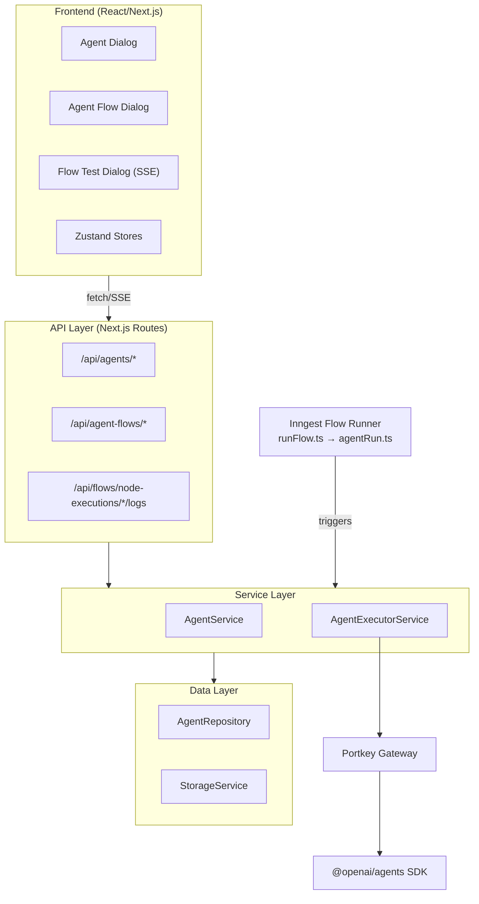

# Agent & Flow System Reference

> Complete developer reference for the FlyRank Agent & Agent Flow system.
> Covers core concepts, architecture, implementation details, streaming, and extension guides.

See `docs/user/AGENTS-AND-FLOWS-USER-MANUAL.md` for user-facing behavior and workflows.


## Glossary (Read First)

| Term | Definition |
|---|---|
| **Agent** | A configured LLM instance with instructions, tools, and optional structured output |
| **Agent Flow** | An ordered pipeline of agents executing together |
| **Artifact** | Named output from a generate-mode agent flow, available to downstream nodes |
| **Agent Key** | Chat persona identifier (`babo`) used by the generalized chat runtime |
| **Chat Thread** | Persistent chat conversation stored in `chat_threads` and linked `chat_messages` |
| **Built-in Tool** | Tool hosted by OpenAI (web_search, code_interpreter) |
| **Custom Tool** | Tool implemented in our codebase with Zod schemas |
| **Data Tool** | Tool that queries external analytics data sources (currently BigQuery MCP) |
| **Edit Mode** | Agent flow mode that modifies existing content via ToolContext |
| **Generate Mode** | Agent flow mode that produces new content stored as artifacts |
| **Handoff** | Execution mode where one agent delegates to another via SDK mechanism |
| **Inngest** | Background job processing framework used for flow execution |
| **MCP** | Model Context Protocol transport used for BigQuery query and discovery calls |
| **Output Type** | JSON Schema defining structured output format for an agent |
| **Portkey** | LLM gateway/proxy for routing, observability, and key management |
| **Primary Artifact** | The content type a flow operates on (scraped_content, generated_content, etc.) |
| **Runner** | OpenAI SDK class that executes agents with conversation management |
| **Scope Level** | Runtime data boundary (`L1` / `L2` / `L3`) used for `query_bigquery` enforcement |
| **Sequential** | Execution mode where agents run one after another |
| **shouldContinue** | Boolean field in structured output controlling flow continuation |
| **SSE** | Server-Sent Events — protocol for streaming execution logs to the UI |
| **Static Catalog** | BigQuery schema/catalog content injected via `${viewCatalog}` prompt variable |
| **Stop Signal** | Mechanism for agents to halt flow execution (via stop_flow tool or output) |
| **Stream** | The overall content processing pipeline (a React Flow graph) |
| **Template** | Predefined agent/agent flow config in code, activated to DB on demand |
| **Tool Choice** | Setting controlling when the LLM uses tools (auto/required/none/specific) |
| **Tool Context** | Closure-based mutable state shared between tools and agents |
| **Tool Gating** | Automatic removal of edit tools in generate mode |
| **Tool Registry** | Central metadata store for all available tools |
| **Tool Use Behavior** | Setting controlling what happens after tool execution |
| **Trace** | Observability span wrapping agent execution for debugging |

### Scope Legend

| Level | Meaning | Streams | Chat |
|---|---|---|---|
| `L1` | Organization-wide scope | Yes | No |
| `L2` | Client scope | Yes | Yes |
| `L3` | Project/store scope | Yes | Yes |

## Audience

- Backend engineers working on agent execution, orchestration, storage, or services.
- Frontend engineers extending Stream editor, agent dialogs, and flow testing UI.
- Platform engineers touching Supabase schema, Inngest, or Portkey/OpenAI integration.

## Reading Order

1. Architecture Overview
2. Data Model & Constraints
3. Execution Pipeline
4. Agent Flow Node (workflow/agent.run)
5. Agent Execution & Tools
6. Artifacts & Prompt Variables
7. Streaming & Realtime
8. Extension Playbooks

---

## Table of Contents
- [Glossary (Read First)](#glossary-read-first)
- [Audience](#audience)
- [Reading Order](#reading-order)

1. [Core Concepts & Mental Model](#1-core-concepts--mental-model)
   - 1.1 [What Is an Agent?](#11-what-is-an-agent)
   - 1.2 [What Is an Agent Flow?](#12-what-is-an-agent-flow)
   - 1.3 [What Are Tools?](#13-what-are-tools)
   - 1.4 [What Are Artifacts?](#14-what-are-artifacts)
   - 1.5 [What Is ToolContext (Shared Mutable State)?](#15-what-is-toolcontext-shared-mutable-state)
   - 1.6 [What Is Structured Output?](#16-what-is-structured-output)
   - 1.7 [Execution Modes: Sequential vs Handoff](#17-execution-modes-sequential-vs-handoff)
   - 1.8 [Edit Mode vs Generate Mode](#18-edit-mode-vs-generate-mode)
2. [Architecture Overview](#2-architecture-overview)
   - 2.1 [System Diagram](#21-system-diagram)
   - 2.2 [Module Map](#22-module-map)
   - 2.3 [Data Flow: End-to-End Execution](#23-data-flow-end-to-end-execution)
   - 2.4 [Layer Responsibilities](#24-layer-responsibilities)
3. [Directory Structure & File Reference](#3-directory-structure--file-reference)
4. [Type System](#4-type-system)
   - 4.1 [Core Agent Types](#41-core-agent-types)
   - 4.2 [Context Types](#42-context-types)
   - 4.3 [Execution Types](#43-execution-types)
   - 4.4 [Database Record Types](#44-database-record-types)
   - 4.5 [Form / Validation Types](#45-form--validation-types)
5. [Tool System Deep Dive](#5-tool-system-deep-dive)
   - 5.1 [Tool Registry](#51-tool-registry)
   - 5.2 [Tool Categories](#52-tool-categories)
   - 5.3 [Tool Factory Pattern](#53-tool-factory-pattern)
   - 5.4 [Tool Lifecycle During Execution](#54-tool-lifecycle-during-execution)
   - 5.5 [Tool Gating (Mode-Based Restrictions)](#55-tool-gating-mode-based-restrictions)
   - 5.6 [Tool Choice & Tool Use Behavior](#56-tool-choice--tool-use-behavior)
   - 5.7 [Data Tool Contracts](#57-data-tool-contracts)
6. [Agent Factory & OpenAI SDK Integration](#6-agent-factory--openai-sdk-integration)
   - 6.1 [Agent Creation Flow](#61-agent-creation-flow)
   - 6.2 [Model Settings](#62-model-settings)
   - 6.3 [Handoff Construction](#63-handoff-construction)
   - 6.4 [Output Type (Structured Output)](#64-output-type-structured-output)
7. [Schema System](#7-schema-system)
   - 7.1 [JSON Schema to Zod Conversion](#71-json-schema-to-zod-conversion)
   - 7.2 [Schema Builder](#72-schema-builder)
   - 7.3 [Output Type Presets](#73-output-type-presets)
   - 7.4 [Prompt Schema Validation](#74-prompt-schema-validation)
8. [Agent Execution Engine](#8-agent-execution-engine)
   - 8.1 [AgentExecutorService](#81-agentexecutorservice)
   - 8.2 [Execution Phases](#82-execution-phases)
   - 8.3 [Context Manager](#83-context-manager)
   - 8.4 [Output Interpreter](#84-output-interpreter)
   - 8.5 [Error Recovery & Retry](#85-error-recovery--retry)
   - 8.6 [Stop Signal Detection](#86-stop-signal-detection)
9. [Orchestration Layer](#9-orchestration-layer)
   - 9.1 [useAgentOrchestration Hook](#91-useagentorchestration-hook)
   - 9.2 [Sequential Execution](#92-sequential-execution)
   - 9.3 [Handoff Execution](#93-handoff-execution)
   - 9.4 [Conversation History Management](#94-conversation-history-management)
   - 9.5 [Shared Context & Snapshot/Rollback](#95-shared-context--snapshotrollback)
   - 9.6 [Retry with Timeout Recovery](#96-retry-with-timeout-recovery)
10. [Flow Integration (Inngest)](#10-flow-integration-inngest)
    - 10.1 [Agent Node Handler (agentRun.ts)](#101-agent-node-handler-agentrunts)
    - 10.2 [Artifact Building & Merging](#102-artifact-building--merging)
    - 10.3 [Artifact Propagation Between Nodes](#103-artifact-propagation-between-nodes)
    - 10.4 [Flow-Level Stop Propagation](#104-flow-level-stop-propagation)
    - 10.5 [Edge Conditions](#105-edge-conditions)
    - 10.6 [Data Access Layer (BigQuery MCP)](#106-data-access-layer-bigquery-mcp)
11. [Prompt Interpolation](#11-prompt-interpolation)
    - 11.1 [Built-in Variables](#111-built-in-variables)
    - 11.2 [Agent Output Variables](#112-agent-output-variables)
    - 11.3 [Variable Resolution Priority](#113-variable-resolution-priority)
12. [Streaming & Real-Time](#12-streaming--real-time)
    - 12.1 [SSE Architecture](#121-sse-architecture)
    - 12.2 [Backend: Creating SSE Streams](#122-backend-creating-sse-streams)
    - 12.3 [Frontend: Consuming SSE Streams](#123-frontend-consuming-sse-streams)
    - 12.4 [Event Types & Protocol](#124-event-types--protocol)
    - 12.5 [Buffer Management & Error Handling](#125-buffer-management--error-handling)
    - 12.6 [Supabase Realtime Channels](#126-supabase-realtime-channels)
13. [Data Layer](#13-data-layer)
    - 13.1 [Database Schema](#131-database-schema)
    - 13.2 [Repository Pattern](#132-repository-pattern)
    - 13.3 [Service Layer](#133-service-layer)
    - 13.4 [API Routes](#134-api-routes)
14. [Configuration & Templates](#14-configuration--templates)
    - 14.1 [Default Agent Templates](#141-default-agent-templates)
    - 14.2 [Default Agent Flow Templates](#142-default-agent-flow-templates)
    - 14.3 [Template Activation & Instantiation](#143-template-activation--instantiation)
15. [LLM Gateway (Portkey)](#15-llm-gateway-portkey)
16. [Observability & Tracing](#16-observability--tracing)
    - 16.1 [Environment Variables](#161-environment-variables)
17. [Known Constraints and Pitfalls](#17-known-constraints-and-pitfalls)
18. [UI Components](#18-ui-components)
    - 18.1 [Agent Dialog](#181-agent-dialog)
    - 18.2 [Agent Flow Dialog](#182-agent-flow-dialog)
    - 18.3 [Flow Test Dialog](#183-flow-test-dialog)
    - 18.4 [Agent Node Logs Dialog](#184-agent-node-logs-dialog)
    - 18.5 [Agent Node Response Dialog](#185-agent-node-response-dialog)
    - 18.6 [Zustand Stores](#186-zustand-stores)
    - 18.7 [Hooks](#187-hooks)
    - 18.8 [Agent Chat UI](#188-agent-chat-ui)
19. [Extension Guides (How To...)](#19-extension-guides-how-to)
    - 19.1 [Add a New Custom Tool](#191-add-a-new-custom-tool)
    - 19.2 [Add a New Tool Category](#192-add-a-new-tool-category)
    - 19.3 [Add a New Infographic Tool](#193-add-a-new-infographic-tool)
    - 19.4 [Add a New Artifact Type / Primary Artifact](#194-add-a-new-artifact-type--primary-artifact)
    - 19.5 [Add a New Output Type Preset](#195-add-a-new-output-type-preset)
    - 19.6 [Add a New Prompt Variable](#196-add-a-new-prompt-variable)
    - 19.7 [Add a New Agent Execution Mode](#197-add-a-new-agent-execution-mode)
    - 19.8 [Add a New Built-in Tool Integration](#198-add-a-new-built-in-tool-integration)
    - 19.9 [Add a New Default Agent/Flow Template](#199-add-a-new-default-agentflow-template)
    - 19.10 [Add a New SSE Event Type](#1910-add-a-new-sse-event-type)
    - 19.11 [Add a New Context Type](#1911-add-a-new-context-type)
    - 19.12 [Add a New Schema Field Type](#1912-add-a-new-schema-field-type)
    - 19.13 [Add a New Agent Config Field](#1913-add-a-new-agent-config-field)
    - 19.14 [Add or Change Database Fields](#1914-add-or-change-database-fields)
    - 19.15 [Add a New Stream Node Type](#1915-add-a-new-stream-node-type)
20. [Documentation Maintenance Checklist](#20-documentation-maintenance-checklist)

---

## 1. Core Concepts & Mental Model

### 1.1 What Is an Agent?

An **Agent** is a configured LLM instance with a specific personality (instructions), a set of tools it can use, and optional structured output constraints. Think of it as a "specialized worker" — one agent might be an "SEO Fixer" while another is a "Content QA Checker."

**Key properties:**
- **Instructions** (system prompt) — defines the agent's behavior and personality
- **User Message** — the initial user-facing prompt template with variable placeholders
- **Model** — which LLM to use (e.g., `gpt-5-mini`)
- **Tools** — which capabilities the agent has (e.g., `search_replace`, `web_search`)
- **Output Type** — optional JSON Schema for structured responses
- **Handoffs** — other agents this agent can delegate to

Agents are stored in the `agents` table and can be app-wide (`store_id = null`) or store-scoped.

### 1.2 What Is an Agent Flow?

An **Agent Flow** is an ordered pipeline of one or more agents that execute together to accomplish a task. A flow defines:

- **Which agents** run (ordered list of agent IDs)
- **How they connect** — sequential or handoff mode between each pair
- **What they operate on** — edit mode (modify existing content) or generate mode (produce new content)
- **Output variable** — in generate mode, the name used to store the result for downstream consumption

Agent flows are linked to stream nodes via `flow_id` and `flow_node_id`, placing them within the broader content processing pipeline.

### 1.3 What Are Tools?

**Tools** are capabilities given to agents that let them take actions beyond generating text. When an agent decides it needs to use a tool, the OpenAI SDK executes the tool function and returns the result to the agent.

There are four categories:

| Category | Description | Examples |
|---|---|---|
| **HTML (General)** | Read, edit, and validate content | `search_replace`, `validate_html`, `stop_flow` |
| **Infographics** | Generate HTML data visualizations | `create_horizontal_bar_chart`, `create_comparison_table` |
| **Data** | Query and inspect analytics data sources | `query_bigquery`, `explore_bigquery` |
| **Built-in** | OpenAI-hosted capabilities | `web_search`, `code_interpreter` |

Tools are defined using Zod schemas (for parameters) and factory functions (for execution logic).

### 1.4 What Are Artifacts?

**Artifacts** are the mechanism for passing data between agent flow nodes in a stream. When an agent flow runs in "generate" mode, its output is stored under a named key (`outputVariableName`). Downstream nodes can reference this output in their prompts using `${agentOutput.variableName}`.

```
Agent Flow Node A (generate mode, outputVariableName: "qaChecklist")
    → produces output → stored in agent_artifacts.outputs.qaChecklist
    
Agent Flow Node B (prompt: "Apply fixes from: ${agentOutput.qaChecklist}")
    → receives qaChecklist from artifacts → uses it in prompt
```

Artifacts are **additive** — they accumulate as they flow through the graph, with each node's output merged into the existing artifact map.

### 1.5 What Is ToolContext (Shared Mutable State)?

`ToolContext` is a **closure-based mutable state container** that tools use to read and modify content during agent execution. It's the bridge between tools and the document being edited.

```typescript
interface ToolContext {
  currentText: string;
  getCurrentText: () => string;
  setCurrentText: (text: string) => void;
}
```

When an agent uses `search_replace`, the tool calls `context.getCurrentText()` to read the current document, applies the replacement, and calls `context.setCurrentText()` to save the result. The next tool call in the same agent (or the next agent in a sequential flow) sees the updated text.

This is the core mechanism enabling **multi-step content editing** — agents can make surgical edits, validate HTML, and build on each other's changes through a single shared reference.

### 1.6 What Is Structured Output?

Agents can be configured with an **output type** (JSON Schema) that forces the LLM to produce structured JSON instead of free-text. This is used for:

- **Validation agents** — return `{ valid: boolean, score: number, issues: string[] }`
- **Flow control** — the `shouldContinue` field tells the orchestrator whether to proceed to the next agent
- **Data extraction** — reliably extract structured data from content

The JSON Schema is stored in the database, converted to a Zod schema at runtime via `jsonSchemaToZod()`, and passed to the OpenAI Agents SDK as `outputType`.

### 1.7 Execution Modes: Sequential vs Handoff

| Mode | How It Works | Use Case |
|---|---|---|
| **Sequential** | Agents run one after another. Conversation history and shared context pass forward. Each agent sees the prior agent's output. | Pipelines where each agent has a distinct role (QA → Fix → Validate) |
| **Handoff** | The first agent delegates to another agent using the OpenAI SDK's built-in handoff mechanism. The SDK manages the transition. | When the initiating agent needs to dynamically decide which specialist to call |

Modes are specified per-transition in the `modes` array: `["sequential", "handoff", "sequential"]` means Agent 1→2 is sequential, Agent 2→3 is handoff, Agent 3→4 is sequential.

### 1.8 Edit Mode vs Generate Mode

| Mode | Purpose | Context | Output |
|---|---|---|---|
| **Edit** | Modify existing content | Loads HTML from `file_url` into ToolContext | Updated `file_url` saved back to storage |
| **Generate** | Produce new content | No text context loaded (tools for editing are stripped) | Output stored in `agent_artifacts.outputs[variableName]` |

In **edit mode**, agents receive content editing tools (`search_replace`, `read_current_text`, etc.) and modify the document in-place. In **generate mode**, these tools are automatically removed (tool gating), and the agent's text output becomes the artifact.

---

## 2. Architecture Overview

### 2.1 System Diagram



### 2.2 Module Map

| Module | Path | Responsibility |
|---|---|---|
| **Agent Factory** | `lib/agents/core/agent-factory.ts` | Creates OpenAI SDK `Agent` instances from DB config |
| **Tool Registry** | `lib/agents/tools/registry.ts` | Single source of truth for all tool metadata |
| **Tool Implementations** | `lib/agents/tools/general/`, `lib/agents/tools/infographics/`, `lib/agents/tools/data/` | Tool factory functions with Zod schemas |
| **Tool Descriptions** | `lib/agents/tools/descriptions.ts` | Runtime tool description extraction |
| **Data Contracts** | `services/agent-data/contracts/query-contracts.ts` | Query schemas, scope schemas, and connector contract |
| **Data Connectors** | `services/agent-data/connectors/bigquery/mcp.connector.ts` | Scoped SQL template execution with safety guardrails |
| **Data Client** | `lib/agent-data-clients/bigquery/mcp.client.ts` | BigQuery MCP transport wrapper (execute/query/discovery) |
| **BigQuery Catalog** | `config/bigquery-catalog.ts` | Static analytics catalog injected via `${viewCatalog}` |
| **Schema System** | `lib/agents/schema/` | JSON Schema ↔ Zod conversion, presets, validation |
| **Session Utils** | `lib/agents/utils/session.utils.ts` | Creates mutable `ToolContext` / `ImageContext` |
| **Payload Builder** | `lib/agents/utils/agent-payload.ts` | Structures input data for agents |
| **Prompt Interpolation** | `lib/utils/prompt-interpolation.ts` | Variable replacement in prompts |
| **Executor Service** | `services/agent-executor.service.ts` | Core execution engine (~1400 lines) |
| **Context Manager** | `services/agent-executor/context-manager.ts` | Resolves text/image/none context |
| **Output Interpreter** | `services/agent-executor/output-interpreter.ts` | Extracts text from SDK results |
| **Agent Service** | `services/agent.service.ts` | Business logic, CRUD, import/export |
| **Agent Repository** | `repositories/agent.repository.ts` | Database access layer |
| **Orchestration Hook** | `inngest/_hooks/useAgentOrchestration.ts` | Multi-agent flow orchestrator |
| **Agent Node Handler** | `inngest/flow/nodeHandlers/agentRun.ts` | Inngest flow node integration |
| **Flow Runner** | `inngest/flow/runFlow.ts` | DAG executor with artifact merging |
| **Chat Service** | `services/chat/chat.service.ts` | Generalized SSE chat orchestration + persistence |
| **Chat Agent Configs** | `config/chat-agents/` | Persona registry keyed by `agent_key` (e.g., `babo`) |
| **Chat APIs** | `app/api/chat/`, `app/api/babo/` | Chat streaming and thread CRUD routes |
| **Logging Utils** | `utils/agent-logging.utils.ts` | Structured logging helpers |
| **Portkey** | `lib/portkey.ts` | LLM gateway initialization |
| **Config Templates** | `config/agent-flows.config.ts` | Default agent/agent flow templates |

### 2.3 Data Flow: End-to-End Execution

This is what happens when an agent flow runs as part of a content processing stream:

```
1. Inngest Flow Runner encounters a 'workflow/agent.run' node
   │
2. agentRun.ts resolves the AgentFlowRecord from DB
   │  ├── Validates all agents exist and are enabled
   │  ├── Normalizes flow scope config (only when query_bigquery is used)
   │  ├── Builds runtime scope context (L1/L2/L3 + allowlisted IDs)
   │  └── Builds inputBuilder() with all upstream data
   │
3. useAgentOrchestration().executeAgentFlow() starts
   │  ├── Creates shared ToolContext from file_url/html
   │  └── Iterates agents based on mode (sequential/handoff)
   │
4. For each agent → AgentExecutorService.executeAgent()
   │  ├── Fetches agent config from DB
   │  ├── Applies tool gating (strips edit tools in generate mode)
   │  ├── Interpolates prompt variables (${keyword}, ${agentOutput.X}, ${viewCatalog})
   │  ├── Creates execution record in DB
   │  ├── Resolves context (text/image/none)
   │  ├── Builds handoff chain (if configured)
   │  ├── Creates Agent instance via agent-factory.ts
   │  │   ├── Resolves tools from string names to SDK objects
   │  │   ├── Injects runtime scope context for query_bigquery
   │  │   ├── Applies model settings (toolChoice, temperature, etc.)
   │  │   └── Converts outputType JSON Schema to Zod
   │  ├── Runs agent via Runner.run() through Portkey → OpenAI
   │  ├── Processes stream items (tool calls, outputs, handoffs)
   │  ├── Detects stop signals
   │  ├── Extracts final text/structured output
   │  └── Updates execution record to completed/failed
   │
5. Back in orchestration:
   │  ├── Checks shouldContinue for flow control
   │  ├── Passes conversation history to next agent (if enabled)
   │  └── Shared ToolContext already mutated by tools
   │
6. Back in agentRun.ts:
   │  ├── Extracts final content from ToolContext
   │  ├── Uploads modified HTML to storage (edit mode)
   │  ├── Builds agent artifacts (generate mode)
   │  └── Returns NodeExecutionResult with artifacts
   │
7. Back in runFlow.ts:
   │  ├── Deep-merges agent_artifacts into next node's input
   │  ├── Checks for stop signals
   │  └── Processes next edges in the DAG
```

### 2.4 Layer Responsibilities

| Layer | Does | Does NOT |
|---|---|---|
| **Repository** | Database CRUD, query building, constraint checking | Business logic, validation, external calls |
| **Service** | Validation, import/export, template management, config normalization | Direct DB access, SDK calls, streaming |
| **Executor** | Agent execution, tool resolution, context management, result extraction | CRUD, template logic, UI concerns |
| **Orchestration** | Multi-agent coordination, retry, conversation management | Single-agent execution details |
| **Node Handler** | Inngest integration, artifact building, flow-level retry | Agent internal execution |
| **API Routes** | HTTP handling, SSE streaming, request validation | Business logic (delegates to service/executor) |
| **UI** | Rendering, user interaction, streaming consumption | Direct API calls to LLM, business logic |

---

## 3. Directory Structure & File Reference

```
lib/agents/
├── core/
│   └── agent-factory.ts              # Creates OpenAI Agent instances from config
├── schema/
│   ├── builder.ts                    # SchemaField[] → JSON Schema, prompt validation
│   ├── json-schema-to-zod.ts         # JSON Schema → Zod schema conversion
│   └── output-type-presets.ts        # Predefined structured output templates
├── tools/
│   ├── index.ts                      # Re-exports all tools
│   ├── registry.ts                   # Tool metadata registry (value, label, category)
│   ├── descriptions.ts               # Runtime tool description extraction
│   ├── general/
│   │   ├── index.ts                  # Re-exports general tools
│   │   ├── read-current-text.tool.ts # Read document content
│   │   ├── search-replace.tool.ts    # Find & replace in document
│   │   ├── replace-full-content.tool.ts # Replace entire document
│   │   ├── validate-html.tool.ts     # 3-layer HTML validation
│   │   ├── stop-flow.tool.ts         # Signal flow termination
│   │   └── utils.ts                  # HTML validation utilities
│   ├── data/
│   │   ├── index.ts
│   │   ├── query-bigquery.tool.ts    # Scope-enforced BigQuery analytics queries
│   │   └── explore-bigquery.tool.ts  # BigQuery schema discovery fallback
│   └── infographics/
│       ├── index.ts                  # Re-exports infographic tools
│       ├── horizontal-bar-chart.tool.ts
│       ├── vertical-bar-chart.tool.ts
│       ├── stacked-bar-chart.tool.ts
│       ├── gauge-chart.tool.ts
│       ├── hierarchy-table.tool.ts
│       ├── multi-attribute-table.tool.ts
│       ├── severity-ladder.tool.ts
│       ├── ordered-list.tool.ts
│       ├── definition-list.tool.ts
│       └── comparison-table.tool.ts
├── utils/
│   ├── agent-payload.ts              # Builds structured agent input payload
│   └── session.utils.ts              # Creates ToolContext (mutable state)
└── test/
    └── agent-flow-test-example.txt   # Sample test input text

lib/agent-data-clients/
└── bigquery/
    └── mcp.client.ts                 # BigQuery MCP transport wrapper (query + discovery)

services/
├── agent.service.ts                  # Business logic for agents/flows
├── agent-executor.service.ts         # Core agent execution engine
├── agent-executor/
│   ├── context-manager.ts            # Resolves text/image/none context
│   └── output-interpreter.ts         # Extracts text from SDK results
├── agent-data/
│   ├── index.ts
│   ├── contracts/
│   │   └── query-contracts.ts        # Query + scope schemas and connector contracts
│   ├── gateways/
│   │   └── analytics-data.gateway.ts # Tool-facing data gateway
│   ├── connectors/
│   │   └── bigquery/
│   │       └── mcp.connector.ts      # SQL templates, scope and SQL guardrails
│   └── scope/
│       └── store-client-scope-adapter.ts
├── chat/
│   ├── chat.service.ts               # Generalized chat orchestration + SSE
│   └── user-scope.service.ts         # Server-side scope resolution for chat

repositories/
├── agent.repository.ts               # Agent/flow persistence
└── chat.repository.ts                # Chat thread/message persistence (agent_key aware)

inngest/
├── _hooks/
│   └── useAgentOrchestration.ts     # Multi-agent flow orchestrator
└── flow/
    ├── runFlow.ts                   # DAG executor (artifact merging)
    └── nodeHandlers/
        └── agentRun.ts              # Agent flow node handler

types/
├── agent.types.ts                    # Core type definitions
├── agent-data.types.ts               # Data query/scope contracts
├── chat.types.ts                     # Chat request/stream/thread contracts
├── agent-chat.types.ts               # Agent chat UI contracts
└── agent-dialog.types.ts             # Form validation (Zod schema)

config/
├── agent-flows.config.ts             # Default agent/agent flow templates
├── bigquery-catalog.ts               # Static BigQuery catalog injected as ${viewCatalog}
└── chat-agents/
    ├── index.ts
    └── babo.config.ts                # Babo chat persona config

utils/
└── agent-logging.utils.ts            # Structured logging helpers

app/api/
├── agents/
│   ├── route.ts                     # GET (list) / POST (create)
│   ├── [id]/route.ts                # GET / PUT / DELETE
│   ├── [id]/toggle/route.ts         # POST enable/disable
│   ├── [id]/duplicate/route.ts      # POST duplicate
│   ├── create-instance/route.ts     # POST from template
│   └── import/route.ts              # POST import agents
└── agent-flows/
    ├── route.ts                     # GET (list) / POST (create)
    ├── [flowId]/route.ts            # GET / PUT / DELETE
    ├── [flowId]/toggle/route.ts     # POST enable/disable
    ├── [flowId]/duplicate/route.ts  # POST duplicate
    ├── test/route.ts                # POST SSE streaming test
    ├── activate/route.ts            # POST activate
    ├── create-instance/route.ts     # POST from template
    ├── import/route.ts              # POST import flow
    └── import-selected/route.ts     # POST import selected flows
├── chat/
│   ├── route.ts                      # POST SSE chat endpoint (agent_key aware)
│   └── threads/
│       ├── route.ts                  # GET/POST threads
│       └── [threadId]/route.ts       # GET/PATCH/DELETE thread
└── babo/
    ├── chat/route.ts                 # Babo compatibility wrapper route
    └── threads/
        ├── route.ts                  # Babo compatibility wrapper route
        └── [threadId]/route.ts       # Babo compatibility wrapper route

components/
├── custom-dialogs/
│   ├── agent-dialog.tsx             # Create/edit agent form
│   ├── agent-flow-dialog.tsx        # Create/edit flow form
│   ├── agent-node-logs-dialog.tsx   # Live streaming execution logs
│   ├── agent-node-response-dialog.tsx # Agent output viewer
│   ├── flow-test-dialog.tsx         # Flow test interface
│   ├── agent-flow-import-dialog.tsx # Import flow UI
│   └── agents-import-dialog.tsx     # Import agents UI
├── custom-sheets/
│   ├── agent-guide-sheet.tsx        # Agent usage guide
│   └── flow-node-sheet.tsx          # Node configuration sidebar
├── form/
│   └── agent-flow-scope-settings.tsx # L1/L2/L3 scope selector for data-enabled flows
├── agent-chat/
│   ├── agent-chat-widget.tsx         # Floating global chat launcher
│   ├── agent-chat.tsx
│   ├── agent-chat-message-list.tsx
│   ├── agent-chat-input.tsx
│   ├── agent-chat-thread-sidebar.tsx
│   ├── agent-chat-scope-selector.tsx
│   └── agent-chat-welcome-state.tsx
├── agents/
│   └── agent-report-viewer.tsx       # Structured report + data preview viewer
└── flow/
    ├── agent-flows-panel.tsx        # Agent flows management panel
    └── nodes/
        └── custom-node.tsx          # React Flow node component

hooks/
├── useFetchAgents.ts                # Fetch agents with pagination
├── useFetchAgentFlows.ts            # Fetch agent flows
├── useAgentForm.ts                  # Agent form logic
├── useChat.ts                        # Generalized chat client hook (pass agentKey)
└── realtime/
    ├── useRealtimeFlowChannel.ts    # Supabase realtime for flows
    ├── useRealtimeFlowExecutionsChannel.ts
    ├── useRealtimeFlowExecutionSingleChannel.ts
    └── useRealtimeFlowNodeExecutionsChannel.ts

store/
├── agentStore.ts                    # Zustand store for agents list
├── agentFlowsStore.ts               # Zustand store for agent flows
└── chatStore.ts                     # Generalized chat UI state
```

---

## 4. Type System

### 4.1 Core Agent Types

```typescript
// Agent configuration (stored in agents.config JSONB column)
interface AgentConfig {
  model: string;                    // e.g., "gpt-5-mini"
  temperature: number;              // 0.0 - 2.0
  reasoning_effort?: "low" | "medium" | "high";
  max_tokens?: number;
  max_turns?: number;
  tools?: string[];                 // Tool identifiers from registry
  accepts_image_input?: boolean;
  outputType?: string | object;     // JSON Schema for structured output
  outputSchema?: object;
  instructions: string;             // System prompt with ${variables}
  user_message?: string;            // User prompt template
  handoffs?: AgentHandoff[];
  tool_instructions_override?: Record<string, string>;
  tool_use_behavior?: 'run_llm_again' | 'stop_on_first_tool' | { stopAtToolNames: string[] };
  model_settings?: {
    toolChoice?: 'auto' | 'required' | 'none' | string;
  };
}

// Agent flow configuration (stored in agent_flows.config JSONB column)
interface AgentFlowConfig {
  agents: number[];                 // Ordered list of agent IDs in persisted flow configs
  modes?: ("sequential" | "handoff")[];  // Transition modes between agents
  max_turns?: number;
  use_conversation_history?: boolean;
  mode?: "edit" | "generate";
  outputVariableName?: string;      // Key for artifact storage (generate mode)
  primary_artifact?: "scraped_content" | "generated_content" | "meta_description" | "image";
  description?: string;
  // query_bigquery flow-level runtime policy:
  scope_level?: "L1" | "L2" | "L3";
  scope_ids?: {
    client_ids?: number[];
    store_ids?: number[];
    store_client_map?: Record<number, number>;
  };
  scope_policy_version?: string;
  allow_l1_scope?: boolean;
}

// Handoff target reference
interface AgentHandoff {
  agentId: number;
  name: string;
}
```

### 4.2 Context Types

```typescript
// Mutable text state for content-editing agents
interface ToolContext {
  currentText: string;
  getCurrentText: () => string;
  setCurrentText: (text: string) => void;
}

// Mutable image state (future use)
interface AgentImageContext {
  currentImageUrl: string;
  getCurrentImageUrl: () => string;
  setCurrentImageUrl: (url: string) => void;
}

// Union type — the context passed to agent factory and runner
type AgentContext = ToolContext | AgentImageContext | null;
```

### 4.3 Execution Types

```typescript
// Input to AgentExecutorService.executeAgent()
interface AgentExecutionInput {
  agentId: number;
  storeId: number;
  contentId?: number;
  input: Record<string, any>;      // All available data (html, keyword, etc.)
  triggeredBy?: string;
  maxTurns?: number;
  useConversationHistory?: boolean;
  agentFlowId?: number;
  // Extended by orchestrator:
  handoffChain?: number[];
  handoffTo?: number;
  conversationHistory?: AgentInputItem[];
  sharedContext?: AgentContext;
}

// Output from AgentExecutorService.executeAgent()
interface AgentExecutionOutput {
  executionId: number;
  status: "completed" | "failed" | "stopped";
  duration_ms: number;
  result: Record<string, any>;
  error?: string;
  stopSignal?: { stop: boolean; reason: string };
  handoffOccurred?: boolean;
  handoffToAgentId?: number;
  executedHandoffAgentIds?: number[];
  agentTitle?: string;
  conversation?: AgentInputItem[];  // For passing to next sequential agent
  max_tokens_reached?: boolean;
  timeout_reached?: boolean;
}
```

### 4.4 Database Record Types

```typescript
// agents table
interface AgentRecord {
  id: number;
  store_id: number | null;    // null = app-wide
  title: string;
  description?: string;
  config: AgentConfig;
  status_id: number;          // 1 = enabled, 0 = disabled
  created_at: string;
  updated_at: string;
}

// agent_flows table
interface AgentFlowRecord {
  id: number;
  store_id: number;
  flow_id?: number;           // FK to flows table
  flow_node_id?: number;      // FK to flows_nodes table
  title: string;
  description?: string;
  config: AgentFlowConfig;
  status_id: number;          // 1 = enabled, 0 = disabled
  created_at: string;
  updated_at: string;
}

// agent_executions table
interface AgentExecutionRecord {
  id: number;
  agent_id?: number;
  agent_flow_id?: number;
  store_id: number;
  content_id?: number;
  status_id: number;          // 1 = running/completed, -1 = failed
  triggered_by?: string;
  metadata?: Record<string, any>;
  started_at: string;
  completed_at?: string;
  duration_ms?: number;
  result?: Record<string, any>;
  error_message?: string;
  trace_id?: string;
}
```

### 4.5 Form / Validation Types

Defined in `types/agent-dialog.types.ts` using Zod:

```typescript
const agentFormSchema = z.object({
  config: z.object({
    model: z.string(),
    temperature: z.number(),
    max_tokens: z.number().optional(),
    instructions: z.string(),
    user_message: z.string().optional(),
    accepts_image_input: z.boolean().optional(),
    tools: z.array(z.string()),
    reasoning_effort: z.enum(["low", "medium", "high"]).optional(),
    tool_instructions_override: z.record(z.string()).optional(),
    tool_use_behavior: z.union([
      z.literal("run_llm_again"),
      z.literal("stop_on_first_tool"),
      z.object({ stopAtToolNames: z.array(z.string()) }),
    ]).optional(),
    model_settings: z.object({
      toolChoice: z.union([
        z.literal("auto"),
        z.literal("required"),
        z.literal("none"),
        z.string(),
      ]).optional(),
    }).optional(),
    outputType: z.union([z.string(), z.record(z.any())]).optional(),
  }),
});
```

---

## 5. Tool System Deep Dive

### 5.1 Tool Registry

The **Tool Registry** (`lib/agents/tools/registry.ts`) is the single source of truth for all available tools. It's metadata-only — it doesn't import any tool implementations, keeping it safe for frontend bundling.

```typescript
type ToolCategory = "html" | "infographics" | "data" | "built-in";

interface ToolDefinition {
  value: string;              // Unique identifier (matches tool `name`)
  label: string;              // Human-readable display name
  description: string;        // Short description for UI tooltips
  category: ToolCategory;
  type: "custom" | "built-in";
}

const TOOL_REGISTRY: ToolDefinition[] = [
  // HTML tools
  { value: "search_replace", label: "Find & Replace", ... },
  { value: "read_current_text", label: "Read Content", ... },
  { value: "replace_full_content", label: "Replace Full Content", ... },
  { value: "validate_html", label: "Validate HTML", ... },
  { value: "stop_flow", label: "Stop Flow", ... },
  
  // Infographic tools (10 total)
  { value: "create_horizontal_bar_chart", label: "Horizontal Bar Chart", ... },
  // ... etc.

  // Data tools
  { value: "query_bigquery", label: "Query BigQuery Analytics", ... },
  { value: "explore_bigquery", label: "Explore BigQuery Schema", ... },
  
  // Built-in tools
  { value: "web_search", label: "Web Search", ..., type: "built-in" },
  { value: "code_interpreter", label: "Code Interpreter", ..., type: "built-in" },
];
```

**Helper functions:**
- `getToolsByCategory()` — groups tools by category
- `getCustomTools()` / `getBuiltInTools()` — filters by type
- `isValidTool(value)` — validates a tool exists
- `getToolDefinition(value)` — returns tool metadata

### 5.2 Tool Categories

**HTML (General) Tools** — operate on the shared `ToolContext`:

| Tool | Purpose |
|---|---|
| `search_replace` | Surgical find-and-replace within HTML |
| `read_current_text` | Read the current document state |
| `replace_full_content` | Replace the entire document |
| `validate_html` | 3-layer HTML validation (structure, DOM, custom rules) |
| `stop_flow` | Signal that the flow should terminate |

**Infographic Tools** — generate HTML elements returned as `{ htmlElement }`:

| Tool | Generates |
|---|---|
| `create_horizontal_bar_chart` | Horizontal bar chart HTML |
| `create_vertical_bar_chart` | Vertical bar chart HTML |
| `create_stacked_bar_chart` | Multi-segment stacked bars |
| `create_gauge_chart` | Circular gauge/meter |
| `create_hierarchy_table` | Hierarchical data table |
| `create_multi_attribute_table` | Multi-column attribute table |
| `create_severity_ladder` | Ranked severity visualization |
| `create_ordered_list` | Styled ordered list |
| `create_definition_list` | Term-definition pairs |
| `create_comparison_table` | Side-by-side comparison |

**Data Tools** — query/read analytics data with runtime-enforced scope:

| Tool | Purpose |
|---|---|
| `query_bigquery` | Run allowlisted BigQuery templates with server-side scope enforcement |
| `explore_bigquery` | Discover dataset/table schema metadata as fallback |

**Built-in Tools** — hosted by OpenAI, no custom implementation:

| Tool | SDK Function |
|---|---|
| `web_search` / `web_search_preview` | `webSearchTool({ searchContextSize: "high" })` |
| `code_interpreter` | `codeInterpreterTool()` |

### 5.3 Tool Factory Pattern

Every custom tool follows the same factory pattern:

```typescript
import { tool } from "@openai/agents";
import { z } from "zod";
import type { ToolContext } from "@/types/agent.types";

export function createMyTool(context: ToolContext) {
  return tool({
    name: "my_tool",  // Must match TOOL_REGISTRY value

    description: `Multi-line description the agent sees.
Include: when to use, examples, rules, constraints.`,

    parameters: z.object({
      param1: z.string().describe("What this parameter is"),
      param2: z.number().optional().describe("Optional parameter"),
    }),

    async execute({ param1, param2 }) {
      try {
        const currentText = context.getCurrentText();
        // ... tool logic ...
        context.setCurrentText(modifiedText);
        return { success: true, message: "Done" };
      } catch (error) {
        return {
          success: false,
          error: error instanceof Error ? error.message : "Unknown error",
        };
      }
    },
  });
}
```

**Key points:**
- Factory receives `ToolContext` and closes over it
- Tool `name` must exactly match the `value` in `TOOL_REGISTRY`
- Parameters defined with Zod schemas (the SDK converts them to JSON Schema for the LLM)
- `execute` is async — tools can do I/O
- Return objects are sent back to the LLM as tool results

**Difference between general and infographic tools:**
- General tools **mutate** `ToolContext` directly (call `setCurrentText`)
- Infographic tools **return HTML** in `{ htmlElement }` — the agent then uses another tool (like `search_replace`) to insert it into the document

**Data tools pattern:**
- Data tools usually do not mutate `ToolContext`
- `query_bigquery` reads runtime scope context and calls `MvpAnalyticsDataGateway`
- `explore_bigquery` calls `BigQueryMcpClient` discovery methods and returns metadata only

### 5.4 Tool Lifecycle During Execution

```
1. Agent config loaded from DB
   config.tools: ["query_bigquery", "web_search", "create_comparison_table"]
   
2. agent-factory.ts iterates tool names:
   ├── "query_bigquery" → createQueryBigQueryTool({ getScopeContext })
   ├── "web_search"     → webSearchTool({ searchContextSize: "high" })
   └── "create_comparison_table" → createComparisonTableTool(context)
   
3. All tools passed to new Agent({ tools: [...] })

4. During Runner.run():
   ├── LLM generates tool_call with arguments
   ├── SDK executes tool's execute() function
   ├── Tool reads/writes via ToolContext
   ├── Result returned to LLM
   └── LLM decides next action (more tools or final response)

5. After execution:
   └── Final text extracted from ToolContext via context.getCurrentText()
```

### 5.5 Tool Gating (Mode-Based Restrictions)

In **generate mode**, content-editing tools are automatically stripped before agent creation:

```typescript
// In AgentExecutorService.executeAgent()
const blockedTools = new Set([
  "search_replace",
  "read_current_text",
  "replace_full_content",
]);

if (flowMode === "generate") {
  finalConfig.tools = finalConfig.tools.filter(t => !blockedTools.has(t));
}
```

This prevents agents from trying to edit content that doesn't exist in generate mode.

### 5.6 Tool Choice & Tool Use Behavior

**Tool Choice** — controls *when* the LLM uses tools:

| Value | Behavior |
|---|---|
| `"auto"` | LLM decides (default) |
| `"required"` | LLM must use at least one tool |
| `"none"` | LLM cannot use tools |
| `"tool_name"` | Force specific tool |

**Tool Use Behavior** — controls *what happens after* a tool is used:

| Value | Behavior |
|---|---|
| `"run_llm_again"` | Continue conversation after tool (default) |
| `"stop_on_first_tool"` | Stop execution after first tool call |
| `{ stopAtToolNames: [...] }` | Stop when specific tools are called |

### 5.7 Data Tool Contracts

`query_bigquery` contract highlights:
- Requires runtime `ScopeContext`; throws if missing
- Accepts allowlisted `query_type` values only
- Uses nullable tool parameters, then strips nulls before gateway validation
- Returns rows + metadata (`row_count`, `truncated`, `scope_applied`, `latency_ms`, `sql_hash`)

`explore_bigquery` contract highlights:
- Actions: `list_datasets`, `get_dataset_info`, `list_tables`, `describe_table`
- Metadata only; does not return analytics rows
- Used as fallback when static `${viewCatalog}` is stale

---

## 6. Agent Factory & OpenAI SDK Integration

### 6.1 Agent Creation Flow

`createAgentInstance()` in `lib/agents/core/agent-factory.ts` transforms database config into an OpenAI SDK `Agent`:

```
Input: DB agent config + context + handoffs
  │
  ├── 1. Resolve tools (string → SDK tool objects)
  ├── 2. Assemble instructions (add handoff prefix if needed)
  ├── 3. Build config object (model, temperature, reasoning_effort, etc.)
  ├── 4. Apply model settings (maxTokens, toolChoice)
  ├── 5. Convert outputType (JSON Schema → Zod)
  └── 6. Create Agent instance
        ├── With handoffs → Agent.create(config) (required for handoff support)
        └── Without handoffs → new Agent(config)
```

### 6.2 Model Settings

The factory handles these model-level settings:

```typescript
const agentConfigObj = {
  name: agentConfig.name,
  model: agentConfig.config.model,        // "gpt-5-mini", "gpt-5", etc.
  instructions: finalInstructions,
  tools: resolvedTools,
  temperature: agentConfig.config.temperature,
  reasoningEffort: agentConfig.config.reasoning_effort,  // "low" | "medium" | "high"
  toolUseBehavior: agentConfig.config.tool_use_behavior,
  modelSettings: {
    maxTokens: agentConfig.config.max_tokens,
    toolChoice: agentConfig.config.model_settings?.toolChoice,
  },
  outputType: zodSchema,  // Only when not streaming
};
```

### 6.3 Handoff Construction

Handoffs allow agents to delegate to other agents. Three resolution paths:

1. **`handoffChain`** — array of agent IDs, creates nested handoff targets
2. **`handoffTo`** — single agent ID for direct handoff
3. **Config-level handoffs** — from `agentConfig.config.handoffs`, supports recursive nesting

When handoffs are present, the agent's instructions are prefixed with `RECOMMENDED_PROMPT_PREFIX` from the OpenAI SDK for proper multi-agent behavior.

### 6.4 Output Type (Structured Output)

The output type system forces LLMs to produce structured JSON:

```
JSON Schema (stored in DB)
    ↓ jsonSchemaToZod()
Zod Schema (runtime)
    ↓ passed to Agent({ outputType })
OpenAI SDK enforces structured output
    ↓
Agent returns parsed JSON matching schema
```

**Note:** Output types are skipped when `isStreaming === true` (the SSE test endpoint) to avoid bundling issues.

---

## 7. Schema System

### 7.1 JSON Schema to Zod Conversion

`lib/agents/schema/json-schema-to-zod.ts` converts JSON Schema to Zod at runtime:

| JSON Schema Type | Zod Type |
|---|---|
| `"object"` | `z.object({...})` with recursive properties |
| `"array"` | `z.array(itemSchema)` |
| `"boolean"` | `z.boolean()` |
| `"number"` / `"integer"` | `z.number()` |
| `"string"` | `z.string()` (or `z.enum()` if `enum` present) |
| `anyOf` / `oneOf` | `z.union([...])` |
| fallback | `z.any()` |

Required fields stay as-is; optional fields get `.optional()` appended.

### 7.2 Schema Builder

`lib/agents/schema/builder.ts` provides utilities for:

- **`generateSchemaFromFields(fields, useShouldContinue)`** — converts UI form fields to JSON Schema
- **`generateExampleOutputFromFields(fields, useShouldContinue)`** — produces a sample JSON for prompt examples
- **`validatePromptSchema(prompt, expectedSchema)`** — finds JSON snippets in prompts and validates them against the schema

The `shouldContinue` boolean field is automatically injected when enabled — this is the standard flow control mechanism.

### 7.3 Output Type Presets

`lib/agents/schema/output-type-presets.ts` provides predefined templates (used by validation helpers; UI does not currently expose a preset picker):

| Preset | Fields | Use Case |
|---|---|---|
| `validator` | `valid`, `score`, `category`, `issues`, `shouldContinue` | Content validation |
| `quality_checker` | `quality`, `score`, `reasons`, `shouldContinue` | Quality assessment |
| `sentiment_analyzer` | `sentiment`, `confidence`, `shouldContinue` | Sentiment analysis |
| `category_classifier` | `category`, `subcategory`, `tags`, `confidence`, `shouldContinue` | Categorization |

### 7.4 Prompt Schema Validation

The builder includes a validation pipeline that checks if agent prompts contain JSON examples matching the expected output schema:

1. `extractSchemaSnippetsFromPrompt()` — finds JSON objects in prompt text
2. `validateSchemaSnippet()` — checks field presence, types, required fields
3. `validatePromptSchema()` — combines both, returns validation results

This helps catch mismatches between the agent's instructions and its configured output type.

---

## 8. Agent Execution Engine

### 8.1 AgentExecutorService

`services/agent-executor.service.ts` (~1400 lines) is the core execution engine. It handles everything from config loading to result persistence.

**Dependencies:**
- `AgentRepository` — database access
- `AgentService` — config fetching
- `StorageService` — HTML upload/download
- `@openai/agents` — Runner, Agent
- Portkey — LLM gateway proxy

### 8.2 Execution Phases

The `executeAgent()` method follows this lifecycle:

| Phase | Description |
|---|---|
| 1. Setup | Initialize Portkey, load agent config, apply tool gating |
| 2. Interpolation | Replace `${variable}` placeholders in instructions/user_message |
| 3. Record | Create execution record in DB (status: running) |
| 4. Context | Resolve text/image/none context via context manager |
| 5. Handoffs | Build handoff agent chain (if configured) |
| 6. Create Agent | Call `createAgentInstance()` with all resolved data |
| 7. Execute | `Runner.run(agent, conversation, options)` via Portkey → OpenAI |
| 8. Process Items | Iterate stream items for tool calls, outputs, handoffs, stop signals |
| 9. Extract Output | Get final text/structured output from result |
| 10. Persist | Upload modified HTML, update execution record |
| 11. Error Recovery | Handle max_turns, max_tokens, timeout as graceful failures |

### 8.3 Context Manager

`services/agent-executor/context-manager.ts` resolves what kind of data the agent works with:

```typescript
function determineContextType(tools: string[], acceptsImageInput?: boolean): "text" | "image" | "none"
```

**Priority:** text tools present → `"text"` → image input configured → `"image"` → `"none"`

**Text context sources:**
1. `file_url` → download and decompress from Supabase storage
2. `html` → use raw HTML string directly

**Image context sources:**
1. Direct URL (`https://...`)
2. Storage path → signed URL
3. Signed URL fails → download + base64 data URI

### 8.4 Output Interpreter

`services/agent-executor/output-interpreter.ts` is a thin wrapper around the SDK's `extractAllTextOutput()`:

```typescript
export function extractAgentTextOutput(items: any[]): string {
  if (!items || !Array.isArray(items)) return "";
  return extractAllTextOutput(items) || "";
}
```

Used when no structured `outputType` is configured — extracts concatenated text from all message items.

### 8.5 Error Recovery & Retry

The executor handles three "graceful failure" scenarios:

| Error Type | Detection | Recovery |
|---|---|---|
| **Max turns exceeded** | Error message contains "max turns" | Save partial output, mark `max_turns_reached` |
| **Incomplete JSON** | Error message contains "JSON" / "Unterminated" | Save partial output, mark `max_tokens_reached` |
| **Timeout** | Error message contains "timed out" / "timeout" | Save partial output, mark `timeout_reached` |

All graceful failures attempt to extract partial output from whatever items were processed via `buildPartialResult()`.

### 8.6 Stop Signal Detection

The executor scans for stop signals from multiple sources:

1. **`stop_flow` tool calls** — tool that explicitly stops the flow
2. **Tool outputs with `{ stop: true }`** — JSON output containing stop signal
3. **Structured output with `shouldContinue: false`** — flow control field

When detected, the execution status is set to `"stopped"` with `stopSignal` metadata.

---

## 9. Orchestration Layer

### 9.1 useAgentOrchestration Hook

`inngest/_hooks/useAgentOrchestration.ts` coordinates multi-agent flows. It exposes two functions:

- `executeAgent(input)` — single agent execution (delegates to executor)
- `executeAgentFlow(flowConfig, baseInput, inputBuilder, onAgentComplete?, onLogEvent?)` — multi-agent orchestration

### 9.2 Sequential Execution

In sequential mode, agents run one after another:

```
Agent 1 → result₁ → Agent 2 → result₂ → Agent 3 → result₃
    │                   │                   │
    └── conversationHistory passed forward ──┘
    └── sharedContext mutated by tools ───────┘
```

After each agent completes:
1. Check `shouldContinue` in structured output — stop if `false`
2. Check `stopSignal` — stop if present
3. Update `conversationHistory` with `result.conversation`
4. Call `onAgentComplete` callback for progress updates

### 9.3 Handoff Execution

In handoff mode, the first agent delegates to a chain of target agents:

```
Agent 1 (initiator) → handoff_chain: [Agent 2, Agent 3]
    │
    └── OpenAI SDK handles handoff internally
    └── Creates transfer_to_<agent_name> tool calls
    └── Synthetic results created for each handoff agent
```

The orchestrator:
1. Collects contiguous handoff-connected agents into a chain
2. Passes `handoffChain` and `handoffTo` in the first agent's input
3. After execution, creates synthetic `AgentExecutionOutput` entries for each agent in `executedHandoffAgentIds`
4. Skips the loop index past the handoff chain

### 9.4 Conversation History Management

- **Initialized as `undefined`** at the start of a flow
- **Updated after each sequential agent** with `result.conversation` (an `AgentInputItem[]` from the SDK)
- **Passed to the next agent** via `conversationHistory` input parameter
- **Disabled** when `use_conversation_history === false`
- **Not used for handoff mode** — the SDK manages conversation internally

### 9.5 Shared Context & Snapshot/Rollback

The orchestration creates a single `ToolContext` shared across all agents in a flow:

```typescript
// Created once at flow start
let sharedContext = createAgentTextContext(text);

// Snapshot before each agent (for rollback on retry)
const snapshot = sharedContext.getCurrentText();

// If agent times out and retries:
resetSessionContext(sharedContext, snapshot);  // Rollback tool mutations
```

This ensures that if an agent fails and retries, its partial tool modifications don't corrupt the shared state.

### 9.6 Retry with Timeout Recovery

```typescript
async function executeAgentWithRetry(
  executor, input, conversationHistory, sharedContext,
  sharedContextSnapshot, retryCount = 0, onLogEvent?
) {
  const result = await executor.executeAgent(input);
  
  if (result.timeout_reached && retryCount < 3) {
    resetSessionContext(sharedContext, sharedContextSnapshot);
    await sleep(2000);
    return executeAgentWithRetry(..., retryCount + 1);
  }
  
  return result;
}
```

Up to 3 retries with context rollback and 2-second delay between attempts.

---

## 10. Flow Integration (Inngest)

### 10.1 Agent Node Handler (agentRun.ts)

`inngest/flow/nodeHandlers/agentRun.ts` is the bridge between the Inngest flow runner and the agent system.

**Responsibilities:**
1. Resolve the `AgentFlowRecord` from database
2. Validate all agents in the flow are enabled
3. Normalize and validate flow scope policy when selected agents use `query_bigquery`
4. Build the `inputBuilder` function that creates per-agent input
5. Execute via `useAgentOrchestration().executeAgentFlow()`
6. Extract final content and build artifacts
7. Handle flow-level retry (timeout, JSON errors — up to 3 attempts)

**The `inputBuilder` function** creates an `AgentExecutionInput` for each agent with:
- `html` — resolved from meta_description, cleaned content, or output text
- All upstream data — keyword, articleUrl, scraped content, etc.
- `agent_artifacts` — from previous nodes
- `agent_runtime.scope_context` — injected only for data-enabled flows (`query_bigquery`)
- `agent_payload` — structured via `buildAgentPayload()`

### 10.2 Artifact Building & Merging

`buildAgentArtifactsOutput()` creates artifacts from agent flow results:

```typescript
function buildAgentArtifactsOutput({
  flowMode,            // "edit" or "generate"
  outputVariableName,  // e.g., "qaChecklist"
  results,             // Array of agent execution results
  existingAgentArtifacts,
  flowNodeId,
  flowTitle,
}) {
  // Only generate-mode flows with an outputVariableName produce artifacts
  if (flowMode === "generate" && outputVariableName) {
    const lastResult = results.findLast(r => r.status === "completed");
    const output = lastResult?.result?.output ?? lastResult?.result;
    
    return {
      outputs: {
        ...existingAgentArtifacts.outputs,
        [outputVariableName]: output,
      },
      outputs_meta: {
        ...existingAgentArtifacts.outputs_meta,
        [outputVariableName]: { flowNodeId, flowTitle },
      },
    };
  }
  return existingAgentArtifacts;
}
```

Current behavior stores generate outputs as raw JSON/object payloads in `agent_artifacts.outputs.<outputVariableName>` (no canonical envelope wrapping).

### 10.3 Artifact Propagation Between Nodes

In `runFlow.ts`, artifacts are deep-merged at each edge transition:

```typescript
// When processing edges between nodes:
const nextNodeInput = { ...result.output, job_data: jobData };

nextNodeInput.agent_artifacts = {
  ...(inputArtifacts || {}),
  ...(outputArtifacts || {}),
  outputs: {
    ...(inputArtifacts.outputs || {}),
    ...(outputArtifacts.outputs || {}),
  },
  outputs_meta: {
    ...(inputArtifacts.outputs_meta || {}),
    ...(outputArtifacts.outputs_meta || {}),
  },
};
```

This ensures downstream nodes see all upstream agent outputs — artifacts are **accumulative**.

### 10.4 Flow-Level Stop Propagation

When an agent node returns `stopped: true`, the flow runner stops processing all subsequent edges:

```typescript
if (result?.output?.stopped === true) {
  const reason = result?.output?.reason || 'Flow stopped by agent';
  logger.info(`Flow stopping at node ${nodeId}: ${reason}`);
  return result;  // No further edges processed
}
```

### 10.5 Edge Conditions

Edges can include `{ path, operator, value }` conditions. These are evaluated in `evaluateCondition` in `inngest/flow/runFlow.ts`.

### 10.6 Data Access Layer (BigQuery MCP)

Data-enabled agent flows use this path:

`query_bigquery` tool -> `MvpAnalyticsDataGateway` -> `BigQueryMcpConnector` -> `BigQueryMcpClient` -> BigQuery MCP server

Key implementation rules:
- Query input is allowlisted via `query_type` templates (no raw SQL from prompts)
- Scope comes from runtime metadata (`agent_runtime.scope_context`), not prompt text
- Scope enforcement is connector-level (`L1` / `L2` / `L3`) with hard-fail on violations
- SQL safety guardrails block non-`SELECT`, mutation keywords, and non-allowlisted view references
- MCP client uses a `180_000ms` client-side timeout and supports schema discovery calls

`explore_bigquery` is metadata-only (dataset/table/schema discovery) and intentionally bypasses scope constraints because it returns no row data.

---

## 11. Prompt Interpolation

### 11.1 Built-in Variables

`renderAgentPromptVariables()` in `lib/utils/prompt-interpolation.ts` replaces `${variableName}` placeholders:

| Variable | Source | Description |
|---|---|---|
| `${cleanedText}` | `cleaned_content_for_AI` or `html` | The main content text |
| `${articleUrl}` | `articleUrl` or `job_data.article_url` | Source article URL |
| `${currentDate}` | `new Date().toISOString()` | Current timestamp |
| `${previousOutputText}` | `output_text` | Previous node's output |
| `${keyword}` | `keyword` | Target keyword |
| `${keywordContext}` | `keywordContext` | Additional keyword context |
| `${metaDescription}` | `meta_description` | Content meta description |
| `${sourceStage}` | `source_stage` | Which pipeline stage triggered this |
| `${primaryArtifact}` | `primary_artifact` | What content type this flow operates on |
| `${imageUrl}` | `image_url` | Image URL |
| `${storagePath}` | `storage_path` | Storage file path |
| `${contentTitle}` | `content_title` or `content_data.title` | Content title |
| `${targetKeywords}` | `targetKeywords` (comma-joined) | Target keyword list |
| `${flowMode}` | `flow_mode` | "edit" or "generate" |
| `${viewCatalog}` | `config/bigquery-catalog.ts` | Static BigQuery catalog injected for analytics agents |

### 11.2 Agent Output Variables

`interpolateAgentOutputs()` resolves `${agentOutput.variableName}` from artifacts:

```typescript
prompt.replace(/\$\{agentOutput\.(\w+)\}/g, (match, variableName) => {
  const output = inputData?.agent_artifacts?.outputs?.[variableName];
  // Resolution priority: string → output.prompt → output.text → JSON.stringify
});
```

### 11.3 Variable Resolution Priority

The interpolation runs in two passes:
1. **Built-in variables** — `${keyword}`, `${cleanedText}`, etc.
2. **Agent output variables** — `${agentOutput.qaChecklist}`, etc.

For agent output resolution, values are resolved with this priority:
1. Raw string → use directly
2. Object with `.prompt` → use `output.prompt`
3. Object with `.text` → use `output.text`
4. Any other object → `JSON.stringify(output)`

---

## 12. Streaming & Real-Time

### 12.1 SSE Architecture

The system uses **Server-Sent Events (SSE)** for real-time streaming. Current SSE endpoints:

1. **`/api/agent-flows/test`** — streams agent flow test execution logs
2. **`/api/flows/node-executions/[nodeExecutionId]/logs`** — streams live node execution logs
3. **`/api/chat`** — streams generalized chat responses/events (`agent_key` aware)
4. **`/api/babo/chat`** — Babo compatibility wrapper over the same chat runtime

### 12.2 Backend: Creating SSE Streams

```typescript
const encoder = new TextEncoder();
let isClosed = false;

const stream = new ReadableStream({
  async start(controller) {
    const sendEvent = (type: string, data: object) => {
      if (isClosed) return;
      try {
        const json = JSON.stringify(data);
        controller.enqueue(encoder.encode(`event: ${type}\n`));
        controller.enqueue(encoder.encode(`data: ${json}\n\n`));
      } catch (err) {
        if (err instanceof TypeError && err.message.includes("already closed")) {
          isClosed = true;
        }
      }
    };

    // Execute agent flow, sending events along the way
    sendEvent("log", { type: "info", message: "Starting execution..." });
    // ... execution logic ...
    sendEvent("complete", { originalText, finalText });
    
    controller.close();
  },
});

return new Response(stream, {
  headers: {
    "Content-Type": "text/event-stream",
    "Cache-Control": "no-cache",
    "Connection": "keep-alive",
  },
});
```

### 12.3 Frontend: Consuming SSE Streams

The frontend uses `fetch()` with `ReadableStream.getReader()`:

```typescript
const response = await fetch(url, {
  method: "POST",
  body: JSON.stringify(payload),
  signal: abortController.signal,
});

const reader = response.body!.getReader();
const decoder = new TextDecoder();
let buffer = "";
let currentEventType = "";

while (true) {
  const { done, value } = await reader.read();
  if (done) break;
  
  buffer += decoder.decode(value, { stream: true });
  const lines = buffer.split("\n");
  buffer = lines.pop() || "";  // Keep incomplete line in buffer
  
  for (const line of lines) {
    if (line.startsWith("event: ")) {
      currentEventType = line.slice(7).trim();
    }
    if (line.startsWith("data: ")) {
      try {
        const data = JSON.parse(line.slice(6));
        handleEvent(currentEventType, data);
      } catch (e) {
        // Ignore malformed chunks
      }
    }
  }
}
```

### 12.4 Event Types & Protocol

**SSE Format:**
```
event: <type>\n
data: <json>\n
\n
```

**Flow test/log event types:**

| Event | Data Fields | Purpose |
|---|---|---|
| `log` | `type`, `message`, `timestamp`, `fullMessage?` | Execution progress |
| `intermediate` | `agentIndex`, `agentTitle`, `currentText` | Between sequential agents |
| `complete` | `originalText`, `finalText`, `agentsExecuted` | Flow finished |
| `error` | `message`, `details?` | Fatal error |
| `timeout` | `message` | Stream timeout (15 min) |

**Log types** within `log` events:

| Type | Color | Purpose |
|---|---|---|
| `info` | Default | General progress messages |
| `stream` | Gray | Text being generated (concatenated) |
| `tool` | Blue | Tool calls and outputs |
| `success` | Green | Successful completions |
| `warning` | Yellow | Non-fatal issues |
| `error` | Red | Errors |

**Chat stream event types (`/api/chat`, `/api/babo/chat`):**

| Event | Data Fields | Purpose |
|---|---|---|
| `scope_confirmation` | `scope_level`, `store_id`, `thread_id` | Confirms resolved L2/L3 runtime scope |
| `delta` | `text` | Streaming assistant token deltas |
| `tool_call_start` | `tool_name`, `args_preview?` | Tool invocation started |
| `tool_call_result` | `tool_name`, `query_type?`, `row_count?`, `truncated?`, `scope_level?`, `latency_ms?`, `sql_hash?` | Tool summary metadata |
| `message` | `thread_id`, `message` | Final assistant message persisted |
| `done` | `thread_id` | Chat turn complete |
| `error` | `message` | Fatal chat stream error |

### 12.5 Buffer Management & Error Handling

**Backend:**
- `isClosed` flag prevents writes after stream close
- Try-catch around `controller.enqueue()` handles disconnected clients
- 15-minute timeout prevents indefinite connections
- Text content truncated (1500-3000 chars) with `fullMessage` for expansion

**Frontend:**
- `AbortController` for request cancellation on unmount/close
- Buffer management for incomplete SSE chunks
- Try-catch around `JSON.parse` for malformed data
- Auto-scroll to latest logs

### 12.6 Supabase Realtime Channels

For production flow executions (not test mode), the system uses Supabase Realtime for live updates:

- `useRealtimeFlowChannel` — flow-level status changes
- `useRealtimeFlowExecutionsChannel` — execution record changes
- `useRealtimeFlowNodeExecutionsChannel` — node execution changes

These hooks subscribe to database change events (INSERT, UPDATE) and update Zustand stores in real-time.

---

## 13. Data Layer

### 13.1 Database Schema

**`agents` table:**

| Column | Type | Notes |
|---|---|---|
| `id` | serial PK | |
| `store_id` | int nullable | `null` = app-wide agent |
| `title` | text | |
| `description` | text nullable | |
| `config` | jsonb | Full `AgentConfig` + instructions |
| `status_id` | int | 1 = enabled, 0 = disabled |
| `created_at` | timestamp | |
| `updated_at` | timestamp | |

**`agent_flows` table:**

| Column | Type | Notes |
|---|---|---|
| `id` | serial PK | |
| `store_id` | int | Always store-scoped |
| `flow_id` | int nullable | FK to `flows` |
| `flow_node_id` | int nullable | FK to `flows_nodes` |
| `title` | text | |
| `config` | jsonb | Full `AgentFlowConfig` |
| `status_id` | int | 1 = enabled, 0 = disabled |
| `created_at` | timestamp | |
| `updated_at` | timestamp | |

**Important constraints:**

- Unique flow per node: `(flow_id, flow_node_id)` when both are not null.
- `auto_create_agent_flow_for_node` creates an empty agent flow when a `workflow/agent.run` node is inserted.
- `agent_flows.flow_node_id` uses `ON DELETE SET NULL` to preserve flows when nodes are deleted.
- `status_id` is the single enable/disable flag for agents and flows.

**`agent_executions` table:**

| Column | Type | Notes |
|---|---|---|
| `id` | serial PK | |
| `agent_id` | int nullable | |
| `agent_flow_id` | int nullable | |
| `store_id` | int | |
| `content_id` | int nullable | |
| `status_id` | int | 1 = running/completed, -1 = failed |
| `triggered_by` | text | |
| `metadata` | jsonb | |
| `started_at` | timestamp | |
| `completed_at` | timestamp nullable | |
| `duration_ms` | int nullable | |
| `result` | jsonb nullable | |
| `error_message` | text nullable | |
| `trace_id` | text nullable | |

**Stream tables (flows):**

| Table | Purpose | Key Columns |
|---|---|---|
| `flows` | Stream metadata | `type`, `metadata`, `status_id` |
| `flows_nodes` | Nodes in a stream | `job_title`, `metadata`, `flow_id` |
| `flows_edges` | Edges between nodes | `source_node_id`, `target_node_id`, `condition`, `metadata` |
| `flows_executions` | Flow run summary | `input`, `output`, `status_id` |
| `flows_nodes_executions` | Per-node run output/logs | `input`, `output`, `status_id`, `flow_node_id` |

**`chat_threads` table:**

| Column | Type | Notes |
|---|---|---|
| `id` | uuid PK | |
| `user_id` | uuid FK | `auth.users(id)` |
| `store_id` | bigint nullable FK | `stores(id)` |
| `scope_level` | text | constrained to `L2` / `L3` |
| `agent_key` | text | chat persona key, default `babo` |
| `title` | text nullable | |
| `created_at` | timestamptz | |
| `updated_at` | timestamptz | |

**`chat_messages` table:**

| Column | Type | Notes |
|---|---|---|
| `id` | uuid PK | |
| `thread_id` | uuid FK | `chat_threads(id)` |
| `role` | text | constrained to `user` / `assistant` / `tool` |
| `content` | text | |
| `tool_calls` | jsonb nullable | summarized tool metadata |
| `created_at` | timestamptz | |

RLS is enabled on both chat tables and scoped to the authenticated owner.

### 13.2 Repository Pattern

`repositories/agent.repository.ts` provides typed database access:

- **Agent CRUD:** `getAgentById`, `createAgent`, `updateAgent`, `deleteAgent`, `toggleAgentEnabled`
- **Flow CRUD:** `getAgentFlowById`, `createAgentFlow`, `updateAgentFlow`, `deleteAgentFlow`, `toggleAgentFlowEnabled`
- **Execution CRUD:** `createExecution`, `updateExecution`
- **Queries:** `getAllAgents` (paginated, filtered), `getAllFlows`, `getFlowsByFlowNode`, `getAgentFlowsUsingAgent`
- **Constraint handling:** Unique title checks, FK validation, JSONB contains queries

`repositories/chat.repository.ts` provides chat persistence:
- Thread CRUD with `agent_key` filtering
- Message CRUD by thread
- Ownership-safe query patterns compatible with RLS

### 13.3 Service Layer

`services/agent.service.ts` adds business logic on top of the repository:

- **Template management:** Syncs config templates to DB, creates instances from templates
- **Import/export:** Copy agents/flows between stores with ID remapping
- **Validation:** Output variable uniqueness per stream, agent enablement checks
- **Config normalization:** Merges partial updates, hydrates description field
- **Agent deletion safety:** Checks if agent is used in flows before deleting

`services/chat/chat.service.ts` adds chat runtime orchestration:
- Resolves scope server-side via `UserScopeService`
- Creates/reuses threads and persists chat/tool messages
- Runs agent with SSE streaming (`delta`, tool events, done/error)
- Supports persona selection via `agent_key`

### 13.4 API Routes

| Route | Method | Description |
|---|---|---|
| `/api/agents` | GET | List agents (paginated, filtered) |
| `/api/agents` | POST | Create agent |
| `/api/agents/[id]` | GET | Get agent by ID |
| `/api/agents/[id]` | PUT | Update agent |
| `/api/agents/[id]` | DELETE | Delete agent |
| `/api/agents/[id]/toggle` | POST | Enable/disable |
| `/api/agents/[id]/duplicate` | POST | Duplicate |
| `/api/agents/create-instance` | POST | Create from template |
| `/api/agents/import` | POST | Import agents |
| `/api/agent-flows` | GET | List flows |
| `/api/agent-flows` | POST | Create flow |
| `/api/agent-flows/[flowId]` | GET | Get flow |
| `/api/agent-flows/[flowId]` | PUT | Update flow |
| `/api/agent-flows/[flowId]` | DELETE | Delete flow |
| `/api/agent-flows/[flowId]/toggle` | POST | Enable/disable |
| `/api/agent-flows/[flowId]/duplicate` | POST | Duplicate |
| `/api/agent-flows/test` | POST | Test flow (SSE streaming) |
| `/api/agent-flows/activate` | POST | Activate flow |
| `/api/agent-flows/create-instance` | POST | Create from template |
| `/api/agent-flows/import` | POST | Import flow |
| `/api/agent-flows/import-selected` | POST | Import selected flows |
| `/api/chat` | POST | Generalized SSE chat endpoint (`agent_key` in body) |
| `/api/chat/threads` | GET | List chat threads for current user + agent key |
| `/api/chat/threads` | POST | Create thread for a scope (`store_id` optional) |
| `/api/chat/threads/[threadId]` | GET | Load a thread and its messages |
| `/api/chat/threads/[threadId]` | PATCH | Rename thread title |
| `/api/chat/threads/[threadId]` | DELETE | Delete thread |
| `/api/babo/chat` | POST | Babo compatibility wrapper chat endpoint |
| `/api/babo/threads` | GET/POST | Babo compatibility wrapper thread routes |
| `/api/babo/threads/[threadId]` | GET/PATCH/DELETE | Babo compatibility wrapper thread route |

---

## 14. Configuration & Templates

### 14.1 Default Agent Templates

Defined in `config/agent-flows.config.ts` as `defaultAgents`. These are seeded to the database on initialization:

```typescript
const defaultAgents: DefaultAgentConfig[] = [
  {
    title: "HTML Beautifier Agent (3)",
    description: "Adds 5 types of HTML enhancements",
    config: {
      model: "gpt-5-mini",
      temperature: 0.5,
      max_tokens: 16384,
      instructions: "You are an HTML beautifier...",
      tools: ["replace_full_content", "validate_html", "read_current_text"],
      // ...
    },
  },
  // ... more templates
];
```

### 14.2 Default Agent Flow Templates

```typescript
const defaultAgentFlows: DefaultAgentFlowConfig[] = [
  {
    title: "Daily Data Analysis (Handoff) (L2->L3)",
    config: {
      agents: ["Data Analysis Manager", "Data Analysis Worker"],  // By title
      modes: ["handoff"],
      use_conversation_history: true,
      mode: "generate",
      outputVariableName: "dailyAnalysis",
      scope_level: "L3",
      scope_ids: { store_ids: [] },
      scope_policy_version: "1.0",
    },
  },
  // ... more templates
];
```

**Note:** Agent flow templates reference agents by **title** (strings), not IDs. Titles are resolved to IDs during activation via `createAgentFlowInstance()`.

### 14.3 Template Activation & Instantiation

1. `initializeAgentsFromConfig()` — syncs all default agents to DB
2. `createAgentInstance(templateKey)` — creates a DB agent from a template with auto-naming
3. `createAgentFlowInstance(params)` — creates a DB flow from a template, resolving agent titles to IDs
4. `initializeSpecificAgents(titles)` — selectively initializes named agents

---

## 15. LLM Gateway (Portkey)

All LLM calls go through **Portkey** as a proxy/gateway:

```typescript
import { initializePortkeyForAgents } from "@/lib/portkey";

// Sets up the OpenAI client to route through Portkey
initializePortkeyForAgents(triggeredBy, virtualKeyId);
```

Portkey provides:
- **API key management** via virtual keys
- **Request routing** to different LLM providers
- **Observability** — logging, cost tracking
- **Environment metadata** — user tracking, environment labeling

The initialization sets the default OpenAI client for the `@openai/agents` SDK to use the Portkey endpoint.

---

## 16. Observability & Tracing

The agent system uses the `@openai/agents` tracing API:

```typescript
import { withTrace, getGlobalTraceProvider } from "@openai/agents";

// Wrap execution in a trace
const result = await withTrace(`Agent: ${agentTitle}`, async () => {
  return await runner.run(agent, conversation, options);
});

// Flush traces
await getGlobalTraceProvider().forceFlush();
```

Trace IDs are stored in `agent_executions.trace_id` for debugging.

Additionally, structured logging follows the FlyRank pattern:

```typescript
import { logAgentError, logAgentInfo, formatDuration } from "@/utils/agent-logging.utils";

logAgentInfo("Agent execution started", { agentId, storeId, model });
logAgentError({
  message: "Agent execution failed",
  error,
  agentId,
  storeId,
  duration_ms,
});
```

### 16.1 Environment Variables

- `AGENTS_VIRTUAL_KEY_ID` — required for agent runs.
- `PORTKEY_API_KEY` — Portkey gateway authentication.
- `OPENAI_API_KEY` — required for trace exports.
- `NEXT_PUBLIC_SUPABASE_URL`, `SUPABASE_SERVICE_ROLE_KEY` — Supabase access.
- `NEXT_PUBLIC_SUPABASE_ANON_KEY` — frontend Supabase client (realtime hooks).
- `BIGQUERY_MCP_ENDPOINT` — BigQuery MCP endpoint URL.
- `BIGQUERY_MCP_PROJECT_ID` — GCP project ID used for MCP calls.
- `BIGQUERY_MCP_CLIENT_EMAIL` — service account client email for MCP auth.
- `BIGQUERY_MCP_PRIVATE_KEY_ID` — service account key id.
- `BIGQUERY_MCP_PRIVATE_KEY` — service account private key (escaped newlines supported).
- `BIGQUERY_MCP_CLIENT_ID` — service account client id.
- `BIGQUERY_MCP_UNIVERSE_DOMAIN` — service account universe domain.
- `BIGQUERY_CENTRAL_DATASET_ID` — optional dataset override (defaults to `central_data_warehouse`).

---

## 17. Known Constraints and Pitfalls

- `outputVariableName` must be **camelCase** and **unique within the stream**.
- `agent_flow_id` in node fields is a hint only; lookup prefers `(flow_id, flow_node_id)`.
- `tool_instructions_override` is stored and passed through UI/test flows, but tool instructions are **not applied** in `agent-factory.ts` / `AgentExecutorService` during runtime.
- Generate mode strips edit tools to avoid modifying non‑existent content.
- Edit mode with `primary_artifact === "image"` is rejected.
- Legacy flows with agent titles (strings) are rejected; must use agent IDs.
- `agent_executions.status_id` does not distinguish running vs completed (both are `1`).
- `agent_flows.flow_node_id` is `ON DELETE SET NULL` — node deletion doesn’t delete flows.
- Scope policy fields are stripped on save when selected agents do not include `query_bigquery`.
- Generate outputs are stored as raw JSON artifacts; canonical envelope wrapping is not active in current runtime.


## 18. UI Components

### 18.1 Agent Dialog

`components/custom-dialogs/agent-dialog.tsx` — create/edit agent form with:
- Model selection
- Temperature slider
- Instructions editor
- Tool selection (grouped by category)
- Data tools section (`query_bigquery`, `explore_bigquery`) from registry metadata
- Output type configuration
- Reasoning effort setting
- Tool choice and tool use behavior

### 18.2 Agent Flow Dialog

`components/custom-dialogs/agent-flow-dialog.tsx` — create/edit agent flow with:
- Agent selection (ordered list)
- Mode configuration (sequential/handoff per transition)
- Edit/Generate mode toggle
- Output variable name (generate mode)
- Conversation history toggle
- Flow-level scope policy controls for data-enabled flows (`L1` / `L2` / `L3`)

### 18.3 Flow Test Dialog

`components/custom-dialogs/flow-test-dialog.tsx` — test an agent flow:
- Text input area with default test text
- Execute button that triggers SSE streaming
- Real-time log display
- Before/After comparison with side-by-side diff
- AbortController for cancellation

### 18.4 Agent Node Logs Dialog

`components/custom-dialogs/agent-node-logs-dialog.tsx` — live execution logs:
- Connects to SSE endpoint for in-progress executions
- Color-coded log entries by type
- Expandable long messages (1500 char threshold)
- Copy logs functionality
- Auto-scroll

### 18.5 Agent Node Response Dialog

`components/custom-dialogs/agent-node-response-dialog.tsx` — view agent output:
- Content type detection (HTML, Markdown, JSON, Plain Text)
- Markdown rendering via `marked`
- Version comparison between agents
- Copy functionality

### 18.6 Zustand Stores

```typescript
// store/agentStore.ts
useAgentStore: {
  allAgents, totalPages, totalAgents,
  sortField, sortDirection, page, itemsPerPage,
  searchTerm, filters, loading,
  setAllAgents, setLoading, resetTableState, ...
}

// store/agentFlowsStore.ts
useAgentFlowsStore: {
  flows, loading,
  setFlows, setLoading,
}

// store/chatStore.ts
useChatStore: {
  threads, activeThreadId, messages, streamingContent,
  awaitingResponse, scopeStoreId, threadSearchQuery, ...
}

// store/globalStore.ts (agent-related global dialogs)
useAgentGuideSheetStore: { isOpen, setOpen }
useAgentDialogStore: { isOpen, agent, setOpen, setAgent }
useAgentFlowDialogStore: { isOpen, flow, setOpen, setFlow }
```

### 18.7 Hooks

| Hook | Purpose |
|---|---|
| `useFetchAgents` | Fetches agents with pagination, integrates with `useAgentStore` |
| `useFetchAgentFlows` | Fetches flows, integrates with `useAgentFlowsStore` |
| `useAgentForm` | Form logic for agent create/edit (save, validate, unsaved changes) |
| `useChat` | Generalized chat hook used by persona UIs (for example `agentKey = "babo"`) |
| `useOutputTypeValidation` | Output schema validation, example generation, prompt alignment |
| `useToolInstructions` | Manage per-tool instruction overrides in the agent dialog |

### 18.8 Agent Chat UI

`components/agent-chat/*` provides the global floating analytics chat:
- `agent-chat-widget.tsx` — launcher + sheet shell mounted in admin layout
- `agent-chat.tsx` — chat shell (threads + messages + input + scope selector)
- `agent-chat-thread-sidebar.tsx` — search, rename, delete threads
- `agent-chat-message-list.tsx` — markdown rendering + tool result cards
- `agent-chat-scope-selector.tsx` — L2/L3 scope picker

Related UI/routes:
- Streams sub-page: `app/(admin)/[storeHandle]/agents/streams/page.tsx`
- Report viewer: `components/agents/agent-report-viewer.tsx`

---

## 19. Extension Guides (How To...)

### 19.1 Add a New Custom Tool

**Step 1: Create the tool file**

Create `lib/agents/tools/<category>/<tool-name>.tool.ts`:

```typescript
import { tool } from "@openai/agents";
import { z } from "zod";
import type { ToolContext } from "@/types/agent.types";

export function createMyNewTool(context: ToolContext) {
  return tool({
    name: "my_new_tool",  // Must match TOOL_REGISTRY value

    description: `Description the agent sees.

**When to Use:**
- Condition 1
- Condition 2

**Rules:**
- Rule 1
- Rule 2

**Examples:**
- Example usage`,

    parameters: z.object({
      param1: z.string().describe("What this parameter does"),
      param2: z.number().optional().describe("Optional numeric parameter"),
    }),

    async execute({ param1, param2 }) {
      try {
        const currentText = context.getCurrentText();
        // ... your tool logic here ...
        context.setCurrentText(modifiedText);
        return { success: true, message: "Operation completed" };
      } catch (error) {
        return {
          success: false,
          error: error instanceof Error ? error.message : "Unknown error",
        };
      }
    },
  });
}
```

**Step 2: Export from category index**

Add to `lib/agents/tools/<category>/index.ts`:

```typescript
export { createMyNewTool } from "./my-new-tool.tool";
```

**Step 3: Register in Tool Registry**

Add to `TOOL_REGISTRY` in `lib/agents/tools/registry.ts`:

```typescript
{
  value: "my_new_tool",
  label: "My New Tool",
  description: "Short description for UI tooltip",
  category: "html",  // or "infographics"
  type: "custom",
},
```

**Step 4: Wire in Agent Factory**

Add case to the tool resolution switch in `lib/agents/core/agent-factory.ts`:

```typescript
case "my_new_tool":
  if (!context || !("getCurrentText" in context)) {
    throw new Error("my_new_tool requires text context");
  }
  tools.push(createMyNewTool(context as ToolContext));
  break;
```

**Step 5: Add to descriptions extractor**

Add case to `lib/agents/tools/descriptions.ts`:

```typescript
case "my_new_tool":
  toolInstance = createMyNewTool(mockContext);
  break;
```

**Step 6: (Optional) Add to tool gating**

If the tool should be blocked in generate mode, add to the `blockedTools` set in `services/agent-executor.service.ts`.

**Files to modify (checklist):**

- [ ] `lib/agents/tools/<category>/<tool-name>.tool.ts` — create
- [ ] `lib/agents/tools/<category>/index.ts` — export
- [ ] `lib/agents/tools/registry.ts` — register
- [ ] `lib/agents/core/agent-factory.ts` — wire
- [ ] `lib/agents/tools/descriptions.ts` — description extraction
- [ ] `services/agent-executor.service.ts` — tool gating (if needed)

---

### 19.2 Add a New Tool Category

**Step 1: Create the category directory**

```
lib/agents/tools/my-category/
├── index.ts
└── my-first-tool.tool.ts
```

**Step 2: Update the `ToolCategory` type**

In `lib/agents/tools/registry.ts`:

```typescript
export type ToolCategory = "html" | "infographics" | "data" | "built-in" | "my-category";
```

**Step 3: Export from main tools index**

In `lib/agents/tools/index.ts`:

```typescript
export * from "./my-category";
```

**Step 4: Register tools in the registry**

Add entries to `TOOL_REGISTRY` with `category: "my-category"`.

**Step 5: Update UI**

The `getToolsByCategory()` function automatically groups by category, so the UI tool selector should pick up the new category. Verify the UI component in `agent-dialog.tsx` renders the new category correctly.

**Reference implementation:** the shipped `data` category (`query_bigquery`, `explore_bigquery`) is a complete example of adding a new category end-to-end.

---

### 19.3 Add a New Infographic Tool

Follow [19.1 Add a New Custom Tool](#191-add-a-new-custom-tool) with these differences:

1. Place in `lib/agents/tools/infographics/`
2. Use `category: "infographics"` in the registry
3. **Return `{ htmlElement }` instead of mutating context:**

```typescript
async execute({ title, data }) {
  const html = generateMyVisualization(title, data);
  return {
    success: true,
    htmlElement: html,
    message: `Created visualization with ${data.length} items`,
  };
},
```

The agent will then use `search_replace` or `replace_full_content` to insert the HTML into the document.

---

### 19.4 Add a New Artifact Type / Primary Artifact

Artifacts support a `primary_artifact` field that indicates what content type the flow operates on.

**Step 1: Add the new value to the type**

In `types/agent.types.ts`, update `AgentFlowConfig`:

```typescript
primary_artifact?: "scraped_content" | "generated_content" | "meta_description" | "image" | "my_new_artifact";
```

**Step 2: Handle in agentRun.ts**

In `inngest/flow/nodeHandlers/agentRun.ts`, add handling for the new artifact type in the `inputBuilder` function (how HTML content is resolved for the agent).

**Step 3: Handle in related node handlers**

If the new artifact type needs special handling in content generation, image generation, or other node types, update those handlers accordingly.

**Step 4: Update the UI**

Add the new option to the agent flow dialog's primary artifact selector.

---

### 19.5 Add a New Output Type Preset

**Step 1: Add to presets file**

In `lib/agents/schema/output-type-presets.ts`:

```typescript
{
  id: "my_preset",
  name: "My Preset",
  description: "What this preset is for",
  schema: {
    type: "object",
    properties: {
      myField: { type: "string", description: "..." },
      score: { type: "number", description: "..." },
      shouldContinue: { type: "boolean", description: "Whether to continue" },
    },
    required: ["myField", "score", "shouldContinue"],
    additionalProperties: false,
  },
  decisionField: "shouldContinue",
  usageExample: `// In Inngest:\nconst result = output.myField;`,
},
```

**Step 2: No other changes needed**

Presets are used by validation helpers (see `useOutputTypeValidation`). The UI does not currently expose a preset selector.

---

### 19.6 Add a New Prompt Variable

**Step 1: Add to the variable map**

In `lib/utils/prompt-interpolation.ts`, add to the `variableMap` in `renderAgentPromptVariables()`:

```typescript
const variableMap: Record<string, string | undefined> = {
  // ... existing variables ...
  myNewVar: agentInput.my_new_field || "",
};
```

**Step 2: Pass the data through**

Ensure `my_new_field` is available in the agent's input data. This means updating:
- `inngest/flow/nodeHandlers/agentRun.ts` — the `inputBuilder` function
- `lib/agents/utils/agent-payload.ts` — the `buildAgentPayload` function

**Step 3: Document in agent instructions**

Users can now use `${myNewVar}` in agent instructions and user messages.

---

### 19.7 Add a New Agent Execution Mode

Currently the system supports `"sequential"` and `"handoff"`. To add a new mode:

**Step 1: Update the type**

In `types/agent.types.ts` and `inngest/_hooks/useAgentOrchestration.ts`:

```typescript
type AgentExecutionMode = "sequential" | "handoff" | "my_new_mode";
```

**Step 2: Implement in the orchestrator**

In `useAgentOrchestration.ts`, add handling in the agent iteration loop:

```typescript
if (transitionMode === "my_new_mode") {
  // Your mode logic here
}
```

**Step 3: Support in SSE test endpoint**

In `app/api/agent-flows/test/route.ts`, add handling for the new mode.

**Step 4: Update the UI**

Add the new mode option to the agent flow dialog's mode selector.

---

### 19.8 Add a New Built-in Tool Integration

Built-in tools are hosted by the LLM provider (OpenAI). To integrate a new one:

**Step 1: Check SDK support**

Verify the `@openai/agents` package exports a factory function for the tool.

**Step 2: Register in Tool Registry**

```typescript
{
  value: "my_builtin_tool",
  label: "My Built-in Tool",
  description: "Description",
  category: "built-in",
  type: "built-in",
},
```

**Step 3: Wire in Agent Factory**

```typescript
case "my_builtin_tool":
case "my_builtin_tool (built-in)":
  tools.push(myBuiltinTool(options));
  break;
```

**Step 4: Add description to descriptions.ts**

In the built-in tool section of `getToolDescription()`:

```typescript
case "my_builtin_tool":
  return "Description of the built-in tool";
```

**Step 5: Handle tool call detection**

In `services/agent-executor.service.ts`, add detection for the new tool's call format in the stream item processing section.

---

### 19.9 Add a New Default Agent/Flow Template

**Step 1: Add agent template**

In `config/agent-flows.config.ts`, add to `defaultAgents`:

```typescript
{
  title: "My New Agent",
  description: "What this agent does",
  config: {
    model: "gpt-5-mini",
    temperature: 0.5,
    max_tokens: 16384,
    instructions: "You are...",
    tools: ["search_replace", "validate_html"],
    tool_use_behavior: "run_llm_again",
    model_settings: { toolChoice: "auto" },
  },
},
```

**Step 2: (Optional) Add agent flow template**

```typescript
{
  title: "My New Flow",
  config: {
    agents: ["My New Agent"],  // Reference by title
    modes: [],
    use_conversation_history: true,
    mode: "edit",
    primary_artifact: "generated_content",
  },
},
```

**Step 3: Initialize**

Call `initializeAgentsFromConfig()` to sync new templates to the database, or use `createAgentInstance(templateKey)` for on-demand creation.

---

### 19.10 Add a New SSE Event Type

**Step 1: Define the event in the backend**

In the SSE endpoint (e.g., `app/api/agent-flows/test/route.ts`):

```typescript
sendEvent("my_event", {
  type: "my_event",
  data: { /* your payload */ },
  timestamp: new Date().toISOString(),
});
```

**Step 2: Handle in the frontend**

In the consuming dialog component:

```typescript
if (currentEventType === "my_event") {
  // Handle your new event
}
```

**Step 3: Update the SSEEventData interface**

Add relevant fields to the event data interface.

---

### 19.11 Add a New Context Type

Currently: `"text"`, `"image"`, `"none"`. To add a new one:

**Step 1: Create the context interface**

In `types/agent.types.ts`:

```typescript
interface MyNewContext {
  currentData: MyDataType;
  getCurrentData: () => MyDataType;
  setCurrentData: (data: MyDataType) => void;
}
```

**Step 2: Update the union type**

```typescript
type AgentContext = ToolContext | AgentImageContext | MyNewContext | null;
```

**Step 3: Create the factory function**

In `lib/agents/utils/session.utils.ts`:

```typescript
export function createMyNewContext(initialData: MyDataType): MyNewContext {
  let currentData = initialData;
  return {
    currentData,
    getCurrentData: () => currentData,
    setCurrentData: (data: MyDataType) => { currentData = data; },
  };
}
```

**Step 4: Update context manager**

In `services/agent-executor/context-manager.ts`:
- Update `determineContextType()` to detect when the new context is needed
- Add a `createMyNewContextFromInput()` function

**Step 5: Update tools**

Create tools that know how to work with `MyNewContext`.

---

### 19.12 Add a New Schema Field Type

The schema builder currently supports: `"boolean"`, `"number"`, `"string"`, `"array"`.

**Step 1: Update SchemaField type**

In `lib/agents/schema/builder.ts`:

```typescript
interface SchemaField {
  name: string;
  type: "boolean" | "number" | "string" | "array" | "my_new_type";
  description?: string;
  required: boolean;
}
```

**Step 2: Update `generateSchemaFromFields()`**

Add handling for the new type in the schema generation logic.

**Step 3: Update `generateExampleOutputFromFields()`**

Add a sample value for the new type.

**Step 4: Update `jsonSchemaToZod()`**

In `lib/agents/schema/json-schema-to-zod.ts`, add the JSON Schema to Zod conversion:

```typescript
case "my_new_type":
  return z.myNewType();
```

---

### 19.13 Add a New Agent Config Field

1. Update `types/agent.types.ts` and `types/agent-dialog.types.ts`.
2. Update `components/custom-dialogs/agent-dialog.tsx` form.
3. Update `hooks/useAgentForm.ts` and any validation hooks.
4. Apply in `AgentExecutorService` or `agent-factory.ts` if needed.

---

### 19.14 Add or Change Database Fields

1. Add a migration in `supabase/migrations`.
2. Update repository types/queries.
3. Update services and UI assumptions.

---

### 19.15 Add a New Stream Node Type

1. Define node in `config/flows.config.ts`.
2. Add a handler in `inngest/flow/nodeHandlers`.
3. Register the handler in `inngest/flow/runFlow.ts`.
4. Add UI configuration fields if needed.

---

## 20. Documentation Maintenance Checklist

- Update this guide when code paths change.
- Update `docs/user/AGENTS-AND-FLOWS-USER-MANUAL.md` for user-facing behavior.
- Keep prompt variables list synchronized between `lib/utils/prompt-interpolation.ts` and `components/custom-dialogs/agent-dialog.tsx`.
- Add tests or update validation hooks when introducing new tools or schema behavior.
