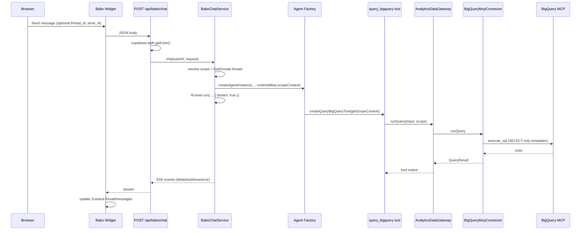

# Babo AI Chat Widget — Architecture

> Status: Implemented (MVP + UI completion pass)
> Parent: [`analytics-agent-flow-bigquery-architecture.md`](./analytics-agent-flow-bigquery-architecture.md) Block 12
> Runtime decision: **Custom streaming chat (no Python sidecar, no ChatKit backend in MVP)**

---

## UI Completion Pass (2026-02-24)

This integration is now upgraded beyond the initial MVP shell:
- Resizable global widget sheet (desktop) with persisted split and full-screen mobile drawer behavior.
- Scroll-safe timeline/composer layout (`min-h-0` chain + single timeline scroll container + jump-to-latest).
- Thread utilities: search + inline rename (`PATCH /api/babo/threads/[threadId]`).
- Sidebar expand/collapse controls and improved thread row readability (timestamps + truncation fixes).
- Message UX polish: relative timestamps + hover absolute dates, richer markdown rendering, compact tool cards.
- Babo-scoped branding via dedicated CSS variables (green/purple accents) with dark/light compatibility.
- Branded empty-state welcome screen with FlyRank logo and randomized onboarding copy on first-open/new-chat.

---

## Goal

Ship a Babo chat widget inside FlyRank Admin where authenticated users can ask analytics questions in natural language.

The MVP must:
- reuse existing agent/tool/scope infrastructure,
- remain fully TypeScript in the app runtime,
- avoid Agent Builder and any Python sidecar,
- preserve strict read-only BigQuery guardrails.

---

## Decision Summary

### Selected approach

**Approach C: Custom streaming UI + `@openai/agents` runner in Next.js.**

### Why this is the best fit for current constraints

- You explicitly do not want a Python sidecar for MVP.
- Self-hosted ChatKit server is officially Python SDK driven today (`openai-chatkit`), which conflicts with your no-sidecar constraint.
- Managed ChatKit would reintroduce hosted workflow/session coupling and split prompt/tool ownership.
- Existing FlyRank code already supports:
  - tool wiring via `createAgentInstance()`,
  - scope closure via `runtimeMeta.scopeContext`,
  - `${viewCatalog}` prompt interpolation,
  - BigQuery read-only guardrails.

---

## Validated Inputs

This plan aligns with:
- Current codebase runtime contracts (`createAgentInstance`, `query_bigquery`, scope schemas, connector SQL scope injection).
- Current DB/repository posture (`store_users`, service-role repository pattern).
- Official OpenAI SDK/docs facts verified during review:
  - ChatKit JS quickstart requires loading `chatkit.js` from OpenAI CDN.
  - ChatKit JS supports `HostedApiConfig` and `CustomApiConfig` on the client.
  - OpenAI JS and Python SDKs both expose managed ChatKit session create/cancel APIs.
  - Official self-hosted ChatKit server starter is Python (`openai-chatkit`), not TypeScript.

---

## Architecture



---

## Reuse Map (No Reinvention)

Use these as-is:
- `lib/agents/core/agent-factory.ts` — `createAgentInstance()`
- `lib/agents/tools/data/query-bigquery.tool.ts` — tool and runtime scope requirement
- `lib/utils/prompt-interpolation.ts` — `${viewCatalog}` interpolation
- `config/bigquery-catalog.ts` — static analytics catalog
- `services/agent-data/gateways/analytics-data.gateway.ts` — gateway layer
- `services/agent-data/connectors/bigquery/mcp.connector.ts` — SQL templates + safety + scope clause
- `services/agent-data/contracts/query-contracts.ts` — `scopeContextSchema`, input schemas
- `repositories/store-users.repository.ts` — user-to-store mapping
- `lib/portkey.ts` — LLM routing init
- `@openai/agents` Runner — agent loop + streaming events

---

## Scope Model (Critical Alignment)

### Single Project selection

Return **L3** scope:
- `scope_level: "L3"`
- `allowed_store_ids: [storeId]`
- `allowed_client_ids: [storeId]` (current warehouse sync assumption)

### All Projects selection

Return **L2** scope (not L1):
- `scope_level: "L2"`
- `allowed_client_ids: userStoreIds`

Rationale: in current connector logic, L1 without explicit client filter resolves to `WHERE TRUE`, which can overexpose data. L2 safely enforces `client_id IN (...)`.

---

## Module Tree (MVP)

```text
config/
  babo-chat.config.ts

types/
  babo-chat.types.ts

supabase/migrations/
  20260401000000_create_babo_chat_tables.sql

repositories/
  babo.repository.ts

services/babo/
  babo-scope.service.ts
  babo-chat.service.ts

app/api/babo/
  chat/route.ts
  threads/route.ts
  threads/[threadId]/route.ts

app/(admin)/
  layout.tsx                            # mounts global widget

components/babo/
  babo-chat-widget.tsx
  babo-chat.tsx
  babo-thread-sidebar.tsx
  babo-message-list.tsx
  babo-input.tsx
  babo-scope-selector.tsx

hooks/
  useBaboChat.ts

store/
  baboStore.ts
```

---

## Block 12.1 — Types + Config

Files:
- `types/babo-chat.types.ts`
- `config/babo-chat.config.ts`

Define:
- thread/message/request/stream event types,
- config for model/instructions/tools,
- conversational instructions based on Data Analysis Worker prompt but adapted for multi-turn UX.

Key config notes:
- Keep `tools: ["query_bigquery"]`.
- Keep `tool_use_behavior: "run_llm_again"`.
- Do **not** use structured `outputType` for chat mode.
- `max_turns` is enforced via `Runner.run(..., { maxTurns })`, not factory config.

---

## Block 12.2 — DB Migration

File:
- `supabase/migrations/20260401000000_create_babo_chat_tables.sql`

Create:
- `babo_threads`
- `babo_messages`

Include:
- FK + cascade delete,
- indexes for `user_id`, `thread_id`, `created_at`,
- RLS policies for user-owned access patterns.

Implementation note:
- Repository may run via service-role client; still enforce user ownership checks in service/API before returning or mutating thread data.

---

## Block 12.3 — Repository + Services

### `repositories/babo.repository.ts`

Methods:
- create/list/get/update/delete thread,
- create/list messages.

### `services/babo/babo-scope.service.ts`

Input:
- `userId`, `storeId | null`

Output:
- `ScopeContext` using rules in Scope Model section.

### `services/babo/babo-chat.service.ts`

Responsibilities:
1. Initialize Portkey (`initializePortkeyForAgents`) before runner execution.
2. Resolve scope and validate user-thread ownership.
3. Create agent via `createAgentInstance` with `runtimeMeta.scopeContext`.
4. Run with `Runner.run(..., { stream: true, maxTurns })`.
5. Convert stream events to API SSE events.
6. Persist user/assistant/tool artifacts to `babo_messages`.
7. Persist tool calls as summary metadata only (`tool_name`, `query_type`, `row_count`, `truncated`, `summary`) to avoid payload bloat.

---

## Block 12.4 — Streaming Chat API

File:
- `app/api/babo/chat/route.ts`

Behavior:
- authenticate via `createClient().auth.getUser()`,
- validate request payload,
- call `BaboChatService.chat(...)`,
- return `text/event-stream` response.

Headers:
- `Content-Type: text/event-stream`
- `Cache-Control: no-cache, no-transform`
- `Connection: keep-alive`

---

## Block 12.5 — Thread APIs

Files:
- `app/api/babo/threads/route.ts`
- `app/api/babo/threads/[threadId]/route.ts`

Routes:
- `GET /api/babo/threads`
- `POST /api/babo/threads` (optional convenience)
- `GET /api/babo/threads/:threadId`
- `DELETE /api/babo/threads/:threadId`

All thread operations must verify `thread.user_id === auth user id`.

---

## Block 12.6 — Frontend

### Page and components

Add:
- `app/(admin)/layout.tsx` (mount global widget component)
- `components/babo/*`
- `store/baboStore.ts`
- `hooks/useBaboChat.ts`

### State + scope UX

- default selected scope from `useProjectStore().selectedProject`,
- options from `useAllProjectsStore().allProjects`,
- scope switch should start a new thread (to avoid mixed-scope history).
- UI entrypoint is a global floating icon in the bottom-right corner on admin routes.

### Streaming event contract (API -> client)

Use these SSE events:
- `delta` — incremental assistant text chunk
- `tool_call_start` — tool invocation metadata
- `tool_call_result` — summarized tool output metadata
- `message` — finalized assistant message payload
- `done` — stream completion
- `error` — terminal error

---

## Block 12.7 — Prompt Adaptation

Source base:
- Data Analysis Worker instructions in `config/agent-flows.config.ts`.

Keep:
- `${viewCatalog}` reference,
- metrics/tiers/flags guidance,
- no fabricated numbers.

Change for conversational mode:
- remove non-conversational directives like "never ask user input",
- allow clarification questions when ambiguous,
- prioritize concise markdown outputs (tables + bullet points),
- use prior thread context for follow-ups.

---

## Security and Guardrails

- Client never sends trusted scope; server resolves scope from auth + store mapping.
- `query_bigquery` still requires runtime scope context and schema validation.
- Connector still enforces SELECT-only templates and disallows mutation patterns.
- Out-of-scope filters hard-fail.
- No write-capable BigQuery path is introduced.

---

## Observability

Log and monitor:
- stream start/finish/error,
- tool call count and latency,
- scope rejection count,
- thread/message persistence failures.

---

## Definition of Done

- Babo global widget streams assistant output in real time.
- Thread/message history persists in Supabase.
- Scope enforcement is server-side and verified for both single-store and all-project modes.
- Existing BigQuery read-only guardrails remain intact.
- No Python sidecar, no Agent Builder dependency, no ChatKit protocol server in MVP.

---

## References

- ChatKit JS quickstart: https://openai.github.io/chatkit-js/
- ChatKit JS type surface (`HostedApiConfig`, `CustomApiConfig`): https://github.com/openai/chatkit-js/blob/main/packages/chatkit/types/index.d.ts
- OpenAI Node SDK ChatKit sessions: https://github.com/openai/openai-node/blob/master/src/resources/beta/chatkit/sessions.ts
- OpenAI Python SDK ChatKit sessions: https://github.com/openai/openai-python/blob/main/src/openai/resources/beta/chatkit/sessions.py
- ChatKit starter app (managed + self-hosted examples): https://github.com/openai/openai-chatkit-starter-app
